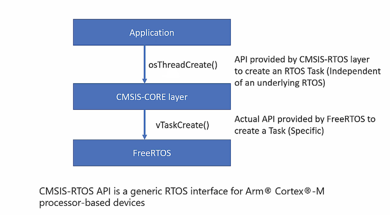
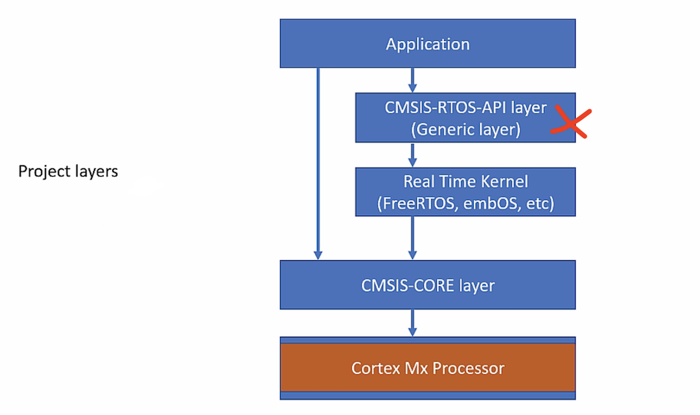

## FreeRTOS Manual Integration without CMSIS-RTOS Layer
     
		 
* Create a project as **New > STM32 Project**    
     
* Choose **STM32Cube** instead of _Empty_ project    
     
* Choose **No** to _Initialise all peripherals with the default Mode_		
    
* We will manually intergrate the FreeRTOS into **STM32Cube** project as shown below.   
      
   
    
* We will not configure FreeRTOS from CubeMX GUI as sometime later we may end up using different IDE/MCU.   
    
    
    
* We will not use CMSIS RTOS layer (And call FreeRTOS APIs directly from Application Layer). However the benefit of using CMSIS RTOS layer incase we end up using different RTOS in the future. We don't have to change our Application layer API's alot if we use CMSIS RTOS layer.				
    
   	
     
		 
* If we were to use CMSIS RTOS layer, Image below shows the typical workflow of calling CMSIS RTOS layer from Application Layer which will in turn invoke RTOS Layer API (i.e. in our case FreeRTOS). 		   
     
 	
    
     
* Our project layer will look like as following without CMSIS-RTOS Layer
     
 			 		 			 	

		 
     
		   					 		 		 

			
			    
      
