## Exercise
     
		 
Write an application that creates 2 tasks, **Task-1** and **Task-2**, 
of equal priorities to print the message `'hello world from Task-x'`  
     
		 
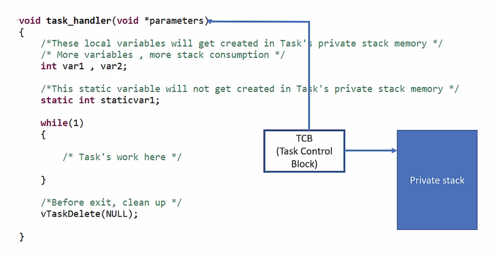  		
    
		
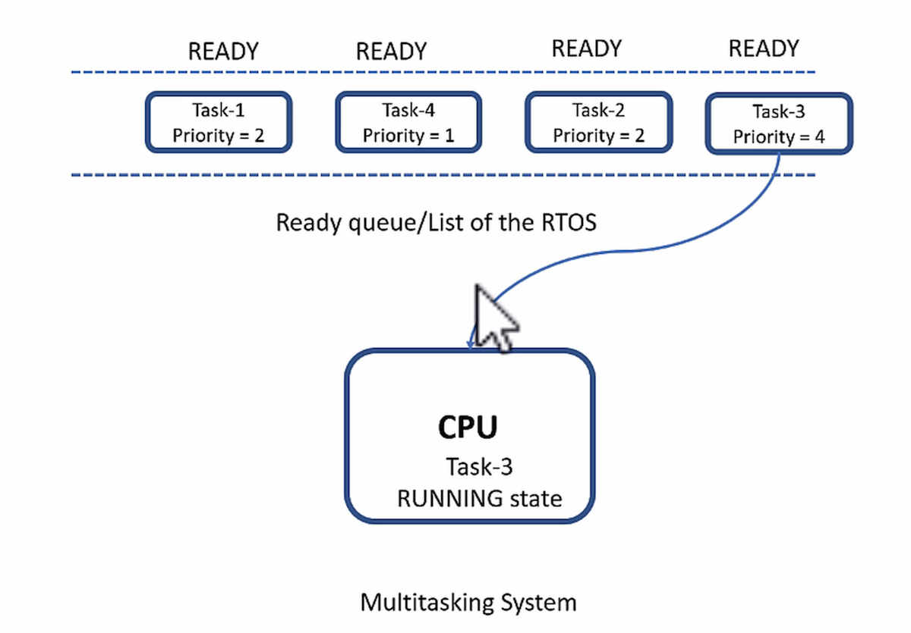  			 
    
## Create a task    
     
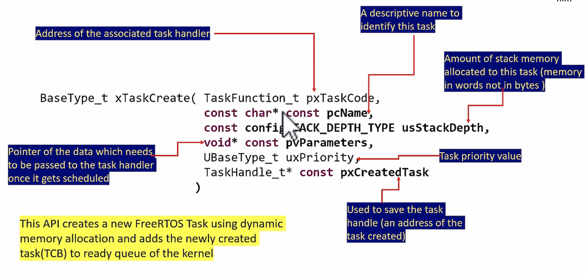     
     
   
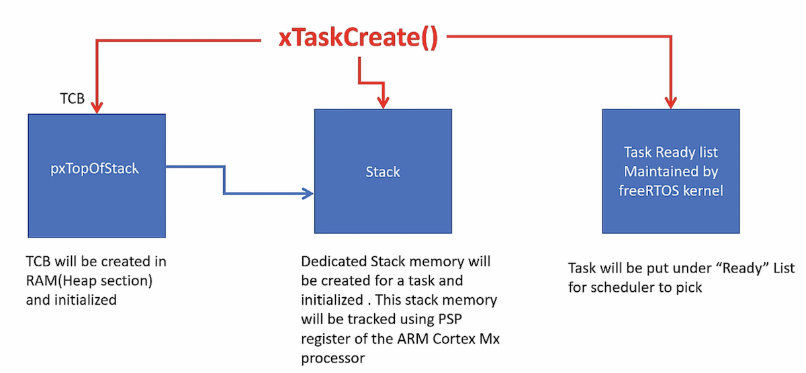        
     
   
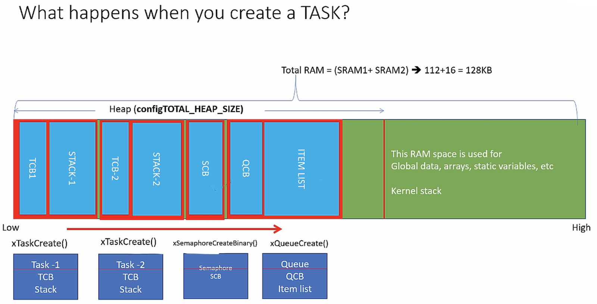  
     
   
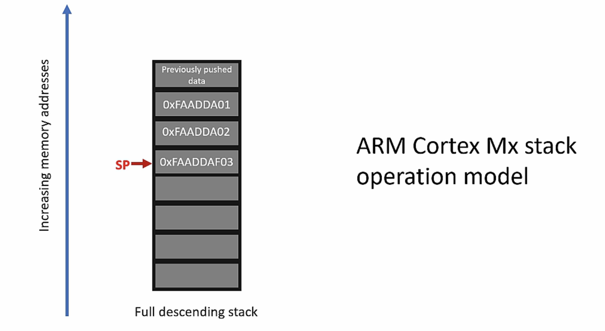  	 	
    
		
## Task priorities in FreeRTOS   
     
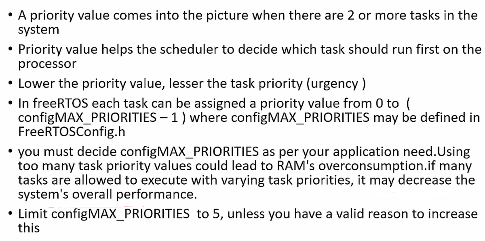  			 		 
    
		
## Scheduling policies in FreeRTOS   
     
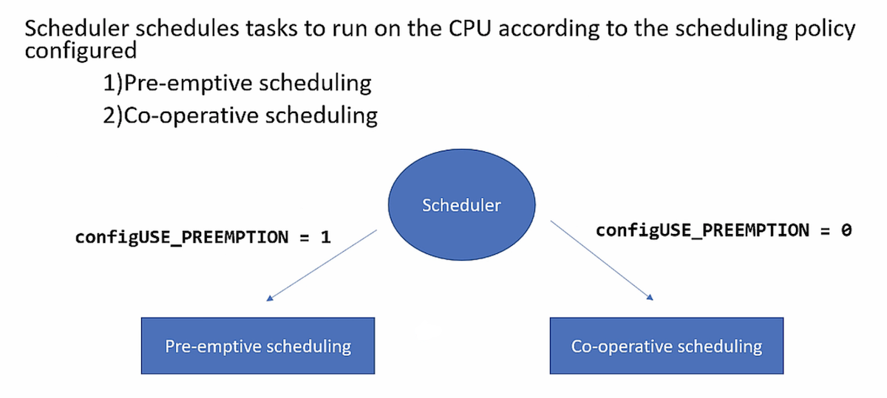  			 		 
    
     
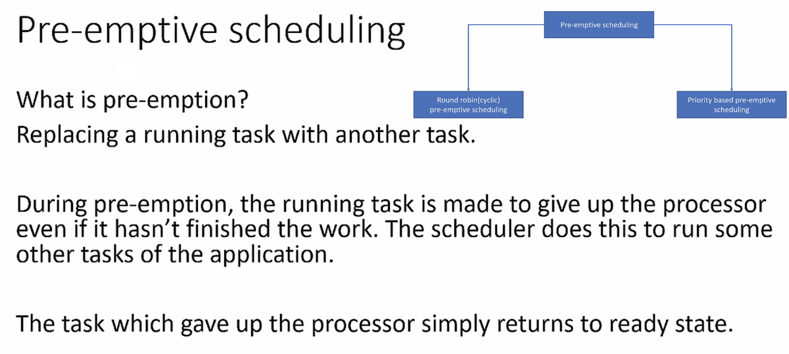 
    
     
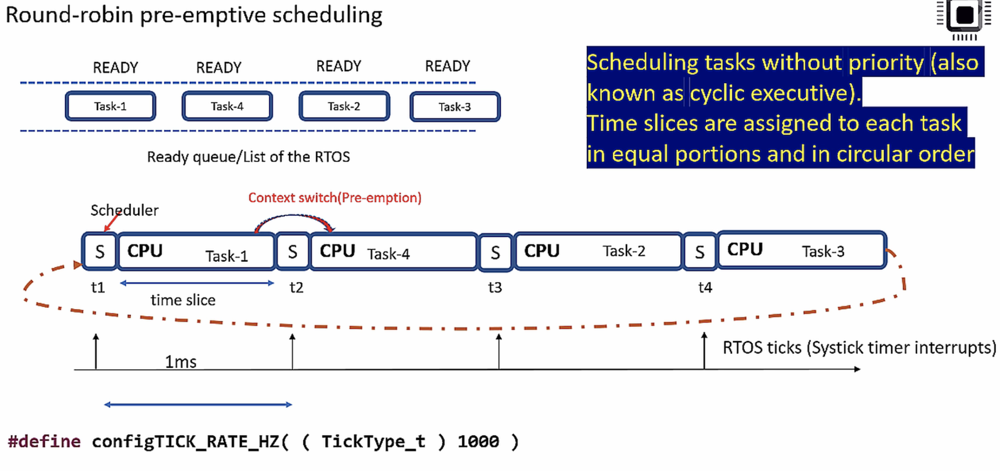   
    
     
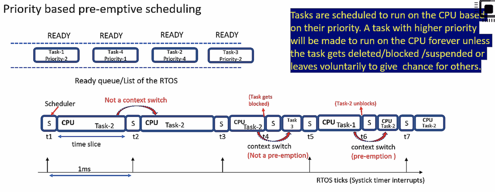    
    
     
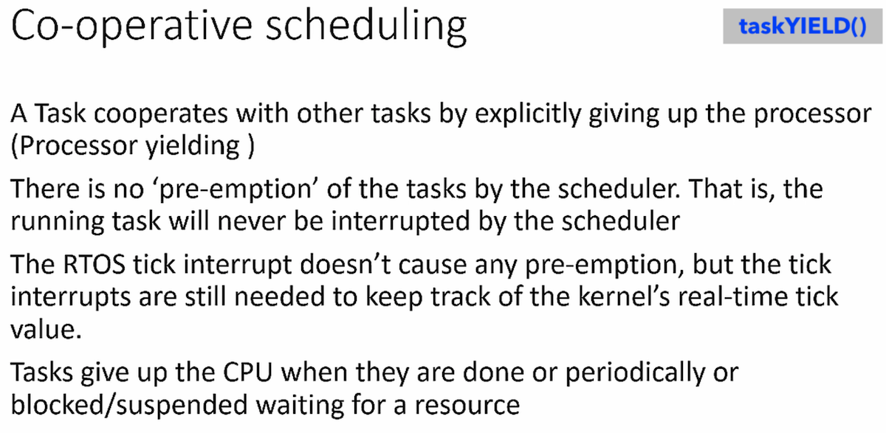   
    
     
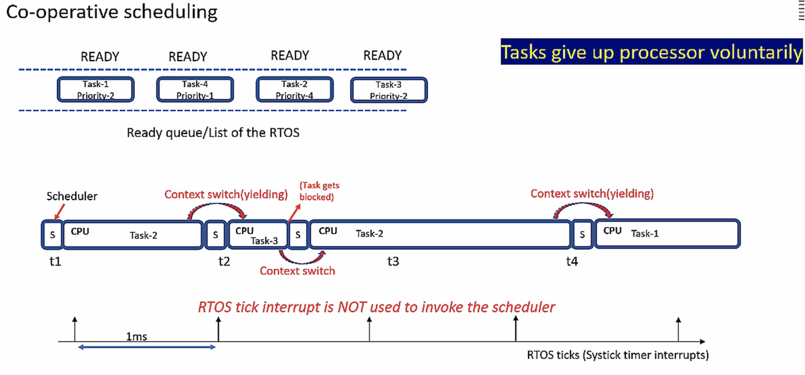   		 		 
    
		
## What is SEGGER SystemView?  
     
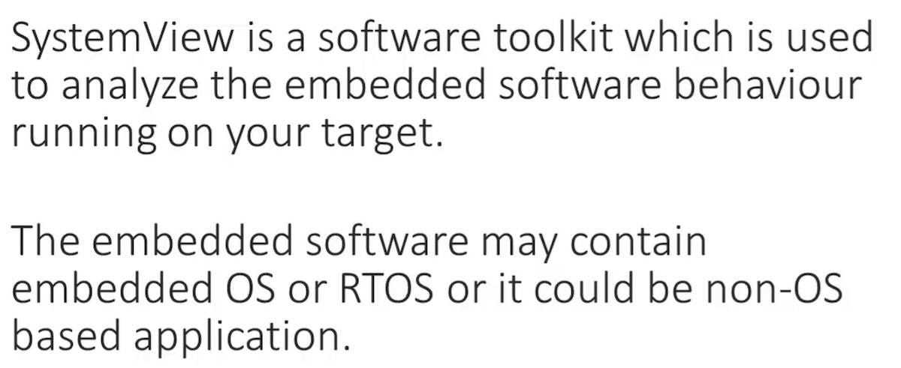  		
     
  			
     
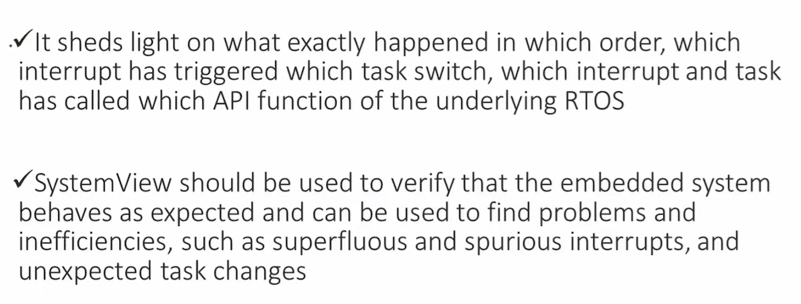  	 
    
		
## SEGGER SystemView Toolkit    
     
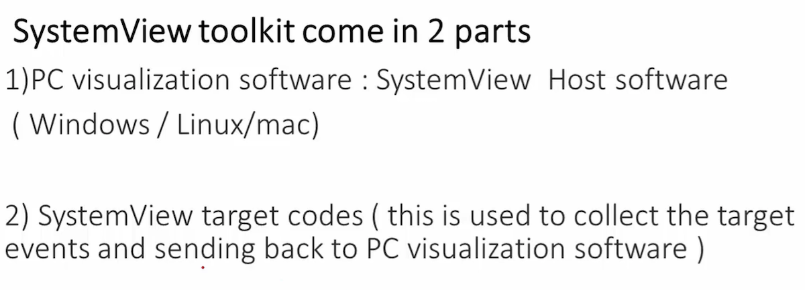  	
     
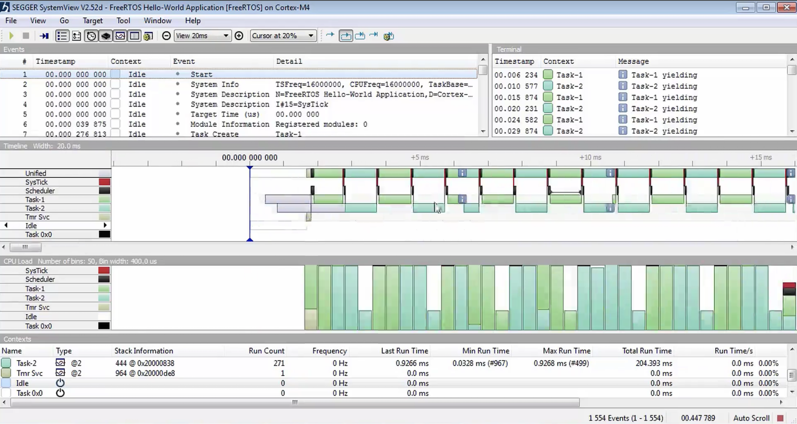  		
     
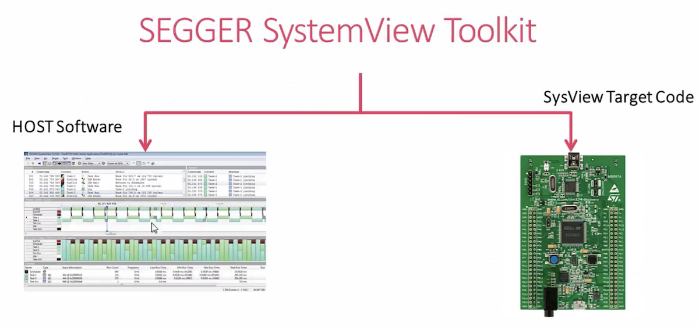  		
    
		
## SystemView Visualisation modes   
     
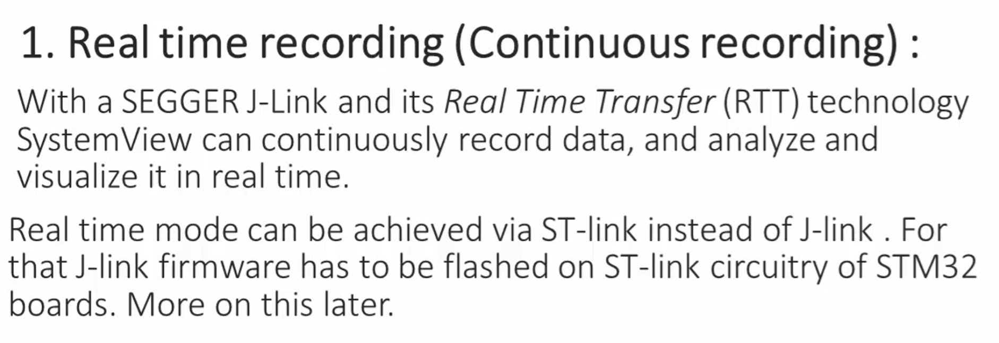  	 
     
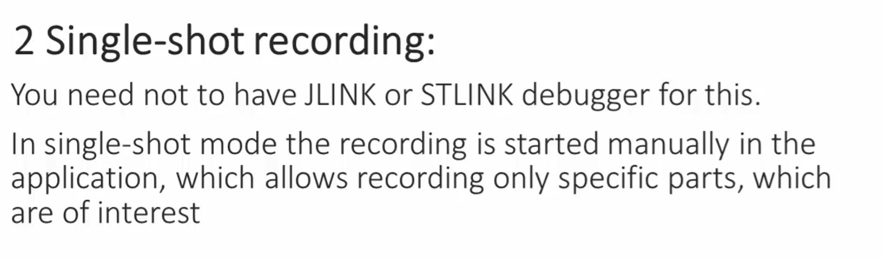  	 
     
  	 
     
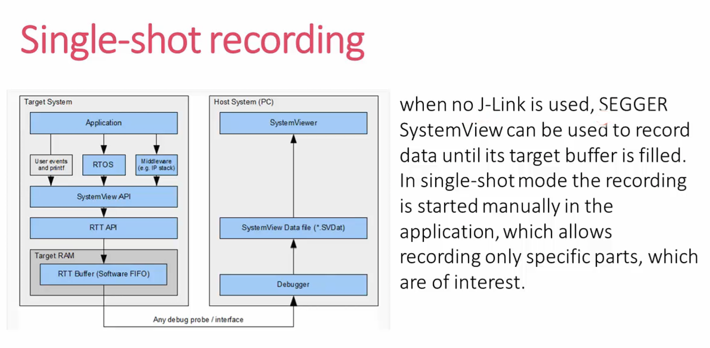  	
     
     	
     	
     
     
    
			 		 
    
     
	 
  

  				 
     

		 
     
		   					 		 		 

			
			    
      
