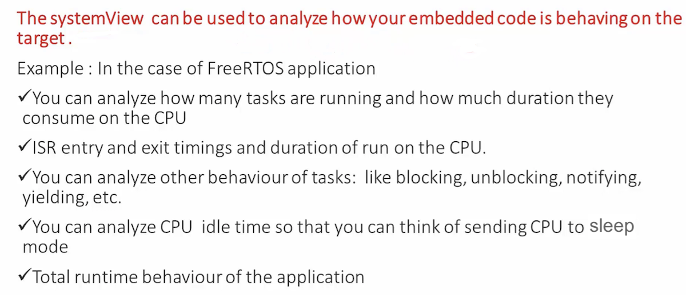
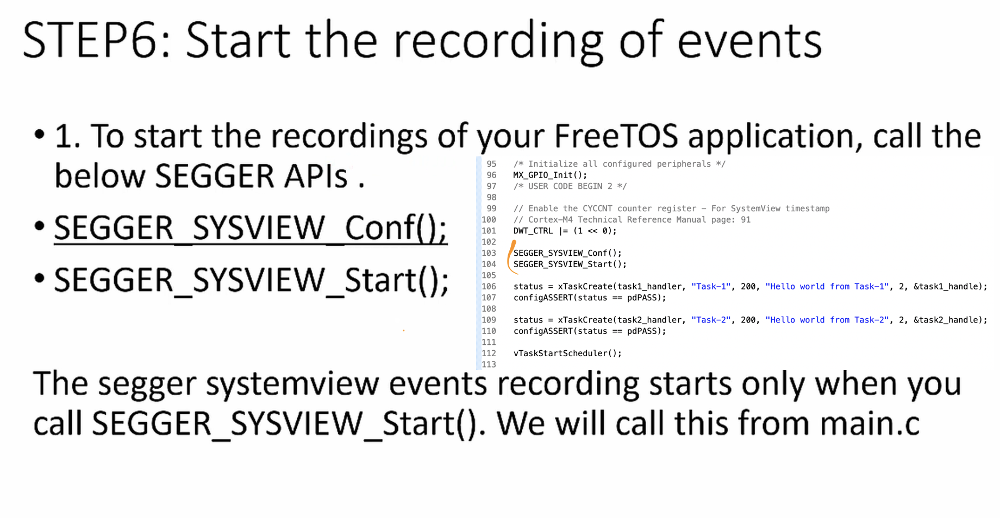
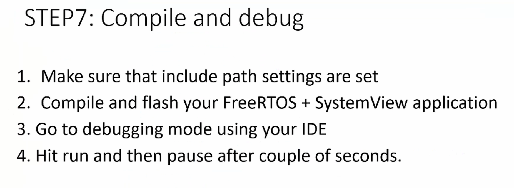
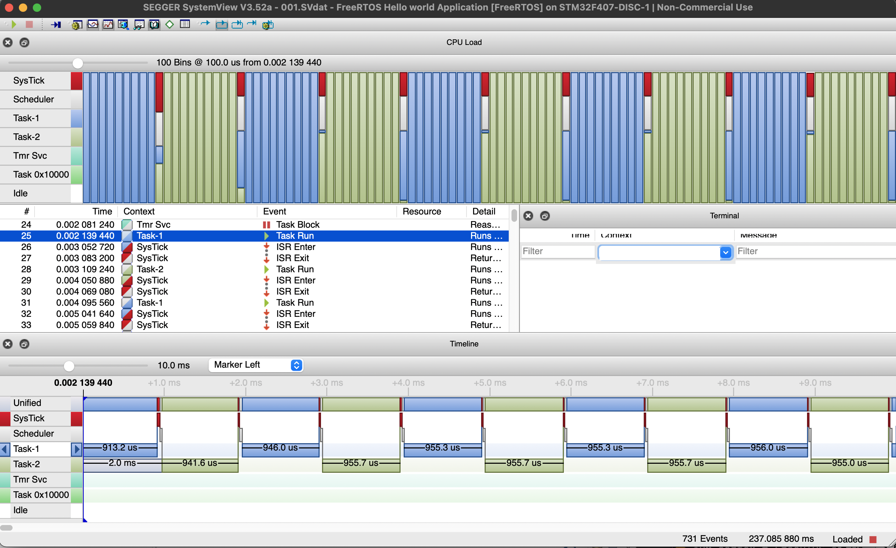
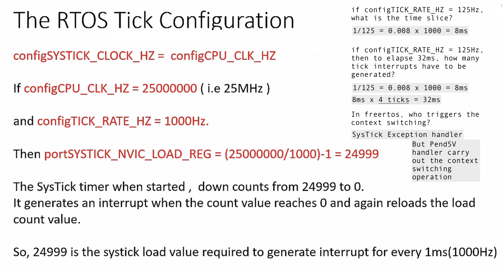
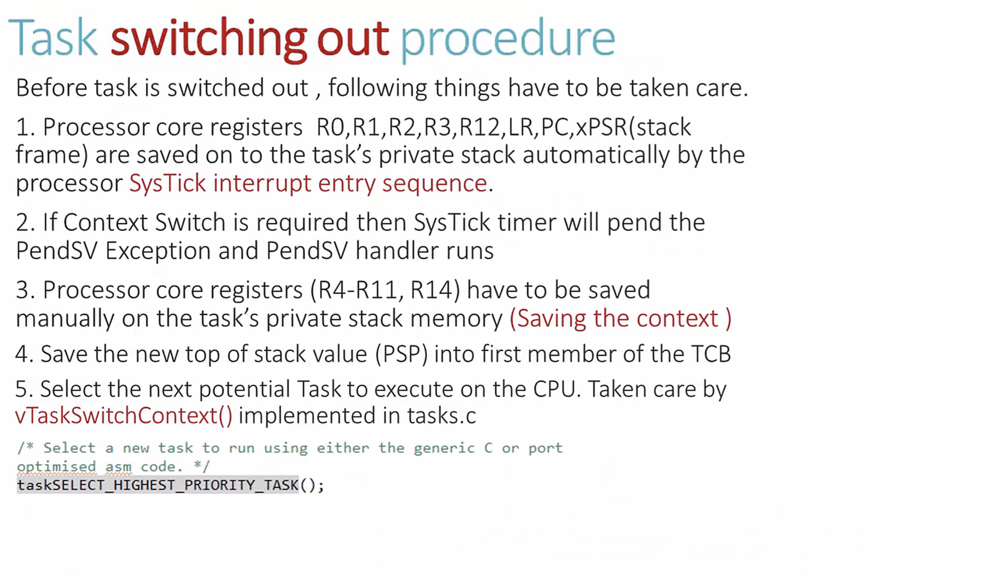
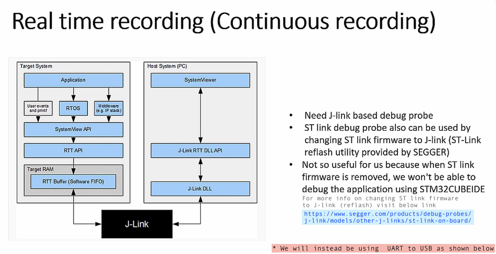
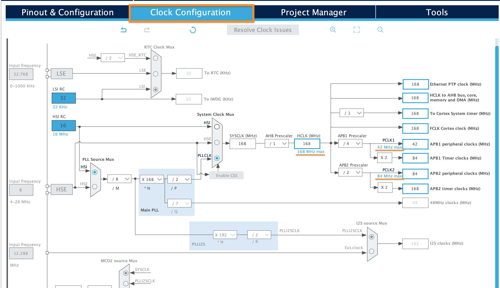

## Exercise
     
		 
Write an application that creates 2 tasks, **Task-1** and **Task-2**, 
of equal priorities to print the message `'hello world from Task-x'`  
     
		 
  		
    
		
  			 
    
## Create a task    
     
     
     
   
        
     
   
  
     
   
  	 	
    
		
## Task priorities in FreeRTOS   
     
  			 		 
    
		
## Scheduling policies in FreeRTOS   
     
  			 		 
    
     
 
    
     
   
    
     
    
    
     
   
    
     
   		 		 
    
		
## What is SEGGER SystemView?  
     
  		
     
  			
     
  	 
    
		
## SEGGER SystemView Toolkit    
     
  	
     
  		
     
  		
    
		
## SystemView Visualisation modes   
     
  	 
     
  	 
     
  	 
     
  	
    
		
## SEGGER SystemView Integration  
     
  	 
     
  	 
     
  	 
     
  	 
     
  	 
     
  	 
     
  	 
     
  	  	 
     
   
    
		
> Run the `01_tasks` app in Debug mode, Hit `Resume` Button on IDE and then `Suspend` button after 2 seconds and will see following screen.
  	 
     

 
    
		
> Write `SEGGER_RTT` in _Expressions_ window and go to `aUP[1] > pBuffer`, copy the address and paste it in `Memory Browser` window, click `binary icon` button and enter the values shown below and save the file with `.SVdat` extension
  	 
     

 
    
		
> Finally open the file with `.SVdat` extension in SEGGER's SystemView
  	 
     
    
  	 
     
     
  	 
     
     
  	 
     
    
  	 
     
     
  	 
     
      
  	 
     
     
  	 
     
      
  	 
     
       
  	 
     
       
  	 
     
    
    
		
   	    
    
		
  	   
    
		
  	     
    
		
  	   
    
		
  	       
    
		
  	   
    
		
  	     
    
		
  	      
    
		
  	 	     
    
		
  	      
  	   	      
  
     
		 
  	
     
		 
  	  
     
		 
  	  
     
		 
  	    
     
		 
  	   
     
		 
  	     
     
		 
  	   
     
		 
  	   
     
		 
  	  
     
		 
> Now, go to CUBEMx `01_tasks.ioc > Clock Configuration` and set the clock to Maximum allowed for STM32F407 which is HCLK (168Mhz), APB1 (42MHz), and APB2 (84MHz) as shown below.     
     
		 
  	  
     
    
	
* Finally call `SEGGER_UART_init(500000)` with Baudrate as 500000 in `main.c`. We will use Co-operative scheduling therefore `configUSE_PREEMPTION` in `FreeRTOSConfig.h` should be **0**. Build/Debug the project into the MCU and Hit **Resume** to run the code. Now go to SystemView **Target** > **Recorder configuration**, Select **UART** from dropdown and give **COM Port** your USB-UART port name (as shown below) and **Speed (in Baud)** as `500000`. And lastly back to SystemView **Target** > **Start Recording**. 	   
     
		 
  	  
    
		
* For some reason, if you would like to change the Main Clock frequency `HLCK` to let's say 50MHz as shown below then you have to make certain changes in `segger_uart.c`.     
     
		 
  	   
    
		
		
* For HCLK at 50MHz, the APB1 will get 25MHz (as USART2 is hanging on APB1 bus). And we have to search in Reference Manual of STM32F407, the maximum baud we can achieve at 25MHz by visiting page **982** under heading **30.3.4 Fractional baud rate generation** as shown below  		
     
		 
  	   
    
     
    
				  
				        
				  
				     
				  
				     
				  
				     
				  
				  
				       
				  
				    
				  
				   

				
				  
				
				  
				
				
				
				  
				
				
     
				
      
				
       
				
      
				
     
				
      
				
     
				
     
     
				
     
     		 
     
     	
     	
     
     
    
			 		 
    
     
	 
  

  				 
     

		 
     
		   					 		 		 

			
			    
      
