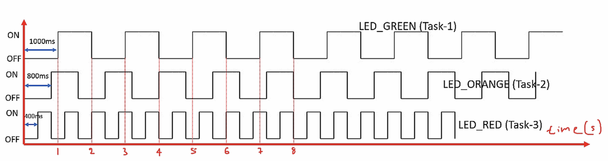
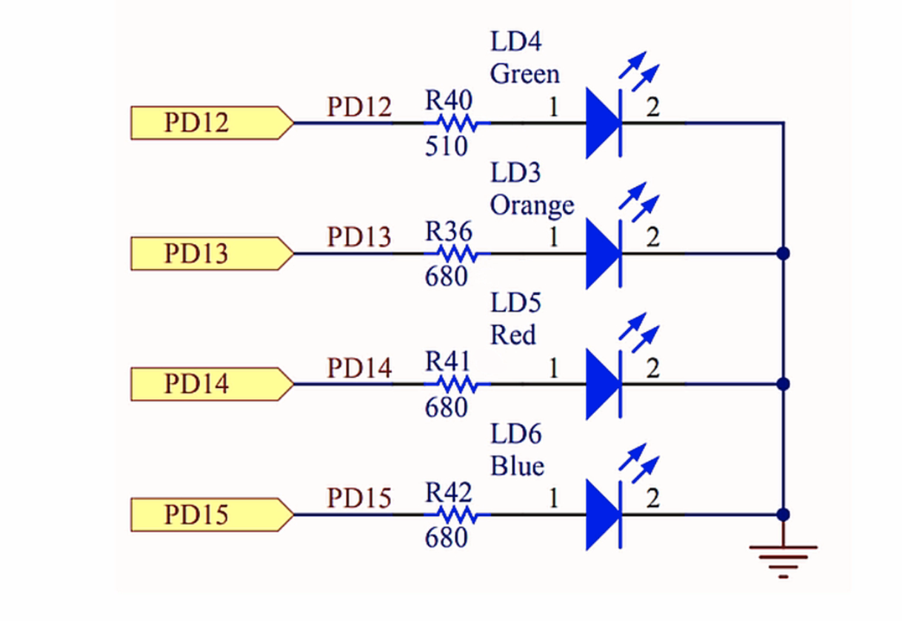
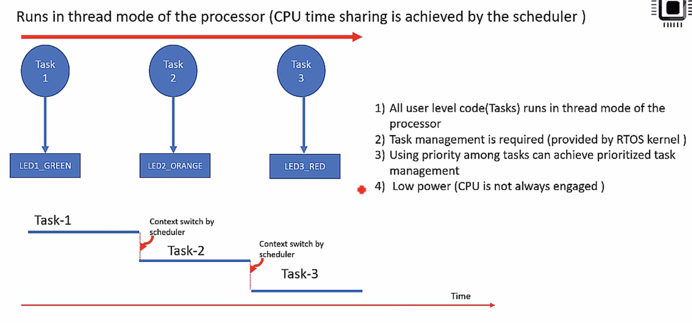

## Exercise    
    
Toggle 3 LEDs of the STM32F407 DISC board with the duration as shown in the below graph.     
     
Create 3 FreeRTOS tasks of the same priority to handle three different LEDs   
     
		 
  	 
     
      
There are 4 LEDs present on the board as shown below.      
		 
       
		 
		 
    
     
     

     
     

     
    
    