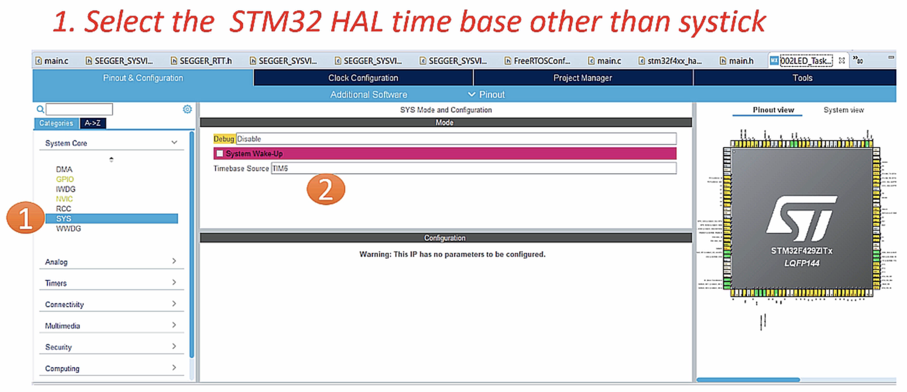
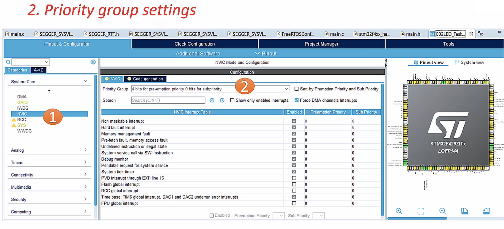
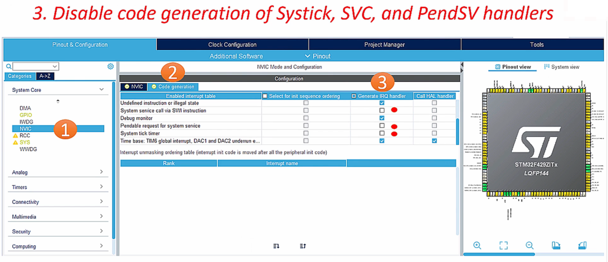
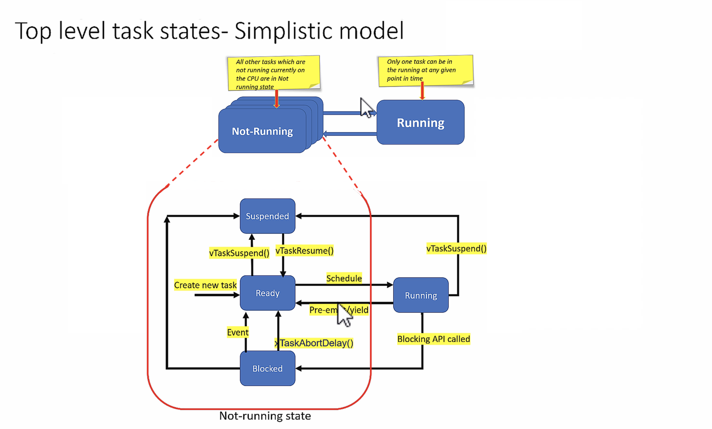
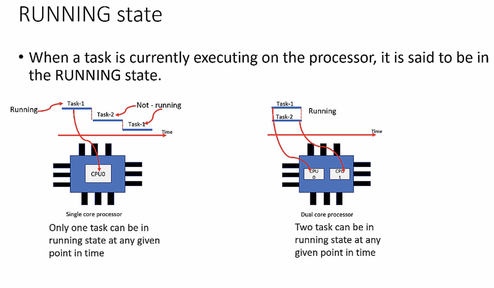
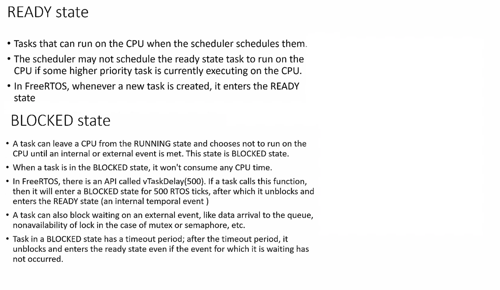
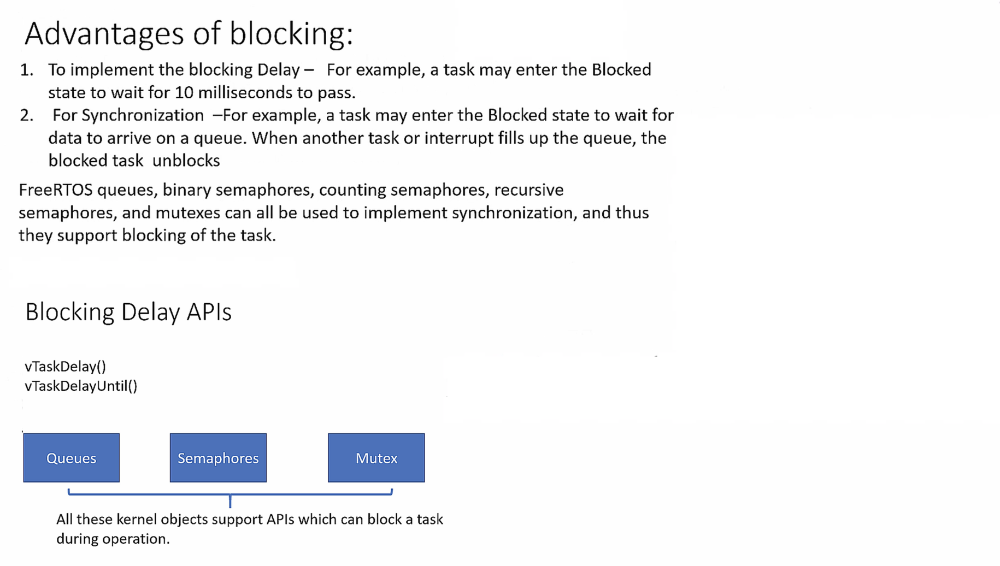
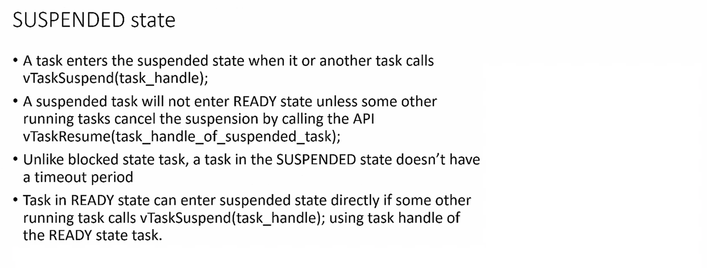

## Exercise    
    
Toggle 3 LEDs of the STM32F407 DISC board with the duration as shown in the below graph.     
     
Create 3 FreeRTOS tasks of the same priority to handle three different LEDs   
     
		 
  	 
     
      
There are 4 LEDs present on the board as shown below.      
		 
       
		 
		 
    
    
    
    
## Incorporating FreeRTOS with HAL layer     
      
For FreeRTOS to work with HAL layer, We have to make few changes.   
   
Spare the SysTick as a TimeBase for FreeRTOS **only** as CubeMx HAL also used it. We can change the CubeMx HAL Timebase to any other timer i.e. TIMER6          
		 
		 
         
		 
		 
    
		 
		 
     
		 
		 
    
		 
		 
    
		 
		 
    
		 
		 
    
		 
		 
    
		 
		 
    
    
    
    
    
    
    
    
    
    
    
  
    
    
    
    
    
    
    
    

     
     

     
     

     
    
    