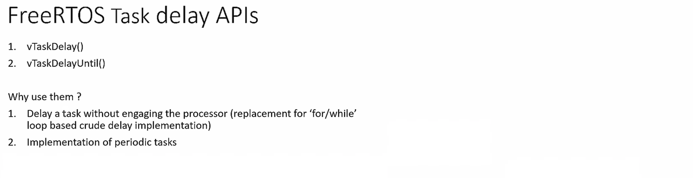
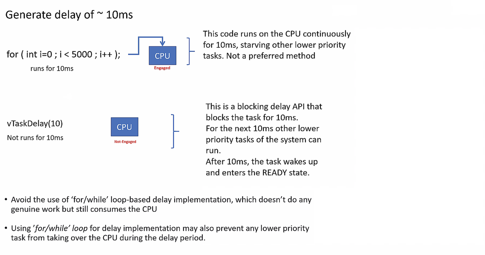
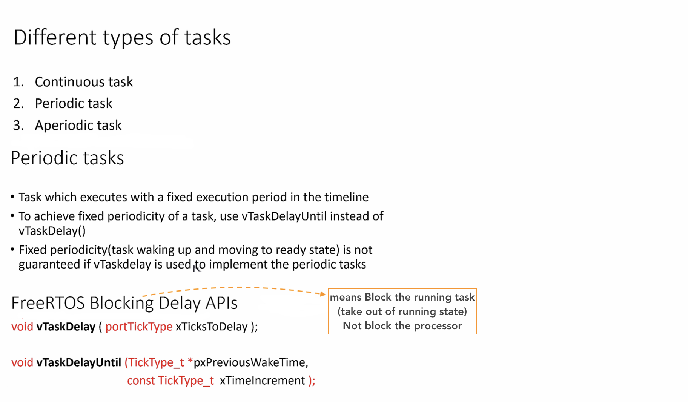
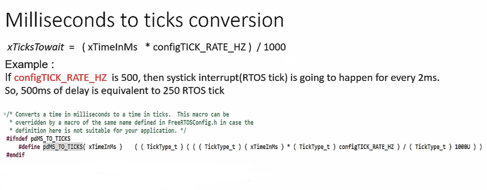
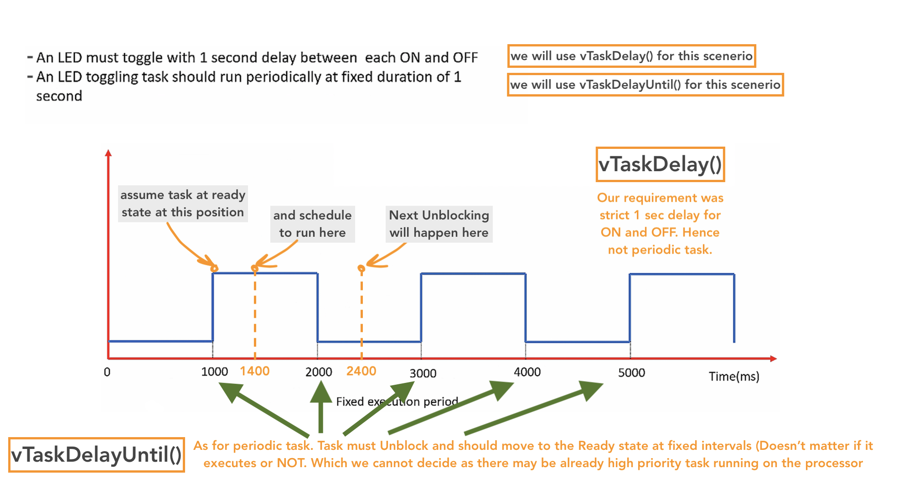
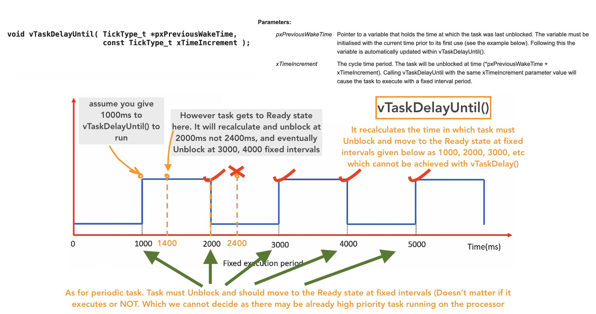
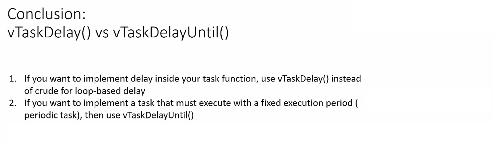
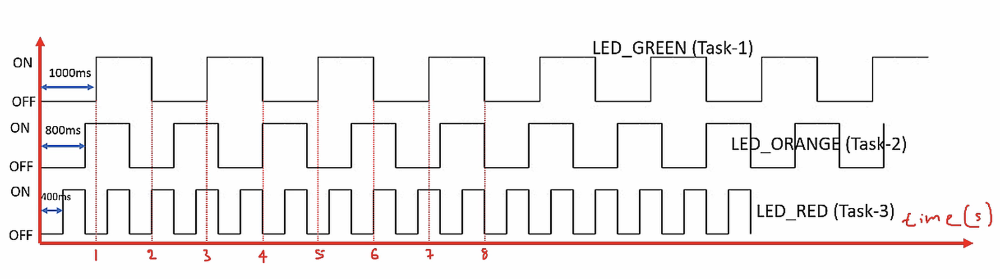

       
		 
		 
   
    
    
         
		 
		 
         
		 
		 
* Go to [API Reference > Task Control](https://freertos.org/a00112.html) for more information   
    
    
         
		 
		 
       
		 
		 
         
		 
		 
		 
## Exercise   
     
* Toggle 3 LEDs of the STM32F407 DISC board with the duration as shown in the below graph.    
    
* Create 3 FreeRTOS tasks of the same priority to handle 3 different LEDs    
    
* Use **vTaskDelay()** for delay implementation    
    
>	`#define INCLUDE_vTaskDelay	1` must be in project specific file `FreeRTOSConfig.h` to use **vTaskDelay()** API   
   
* Don't forget to follow the [4 steps](https://github.com/noargs/ARM-cortex-m-FreeRTOS-stm32fx/tree/main/02_led_tasks#incorporating-freertos-with-hal-layer) to make FreeRTOS compatible with HAL layer.   
    
* HCLK should raise upto 168MHz to work with `segger_uart.c` in case, we wish to get Continuous (Realtime) Recording	  
		 
		 
         
		 
     
		  	 						 		 
		     
		 
	
    
    
    
    
    
    
    
    
    
  
    
    
    
    
    
    
    
    

     
     

     
     

     
    
    