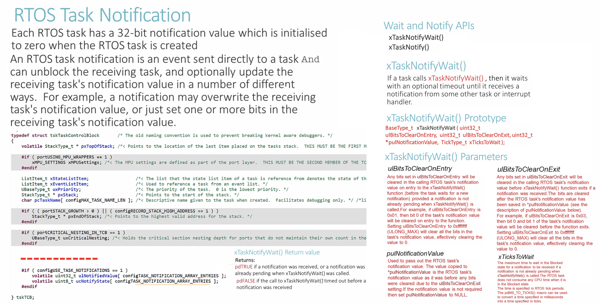
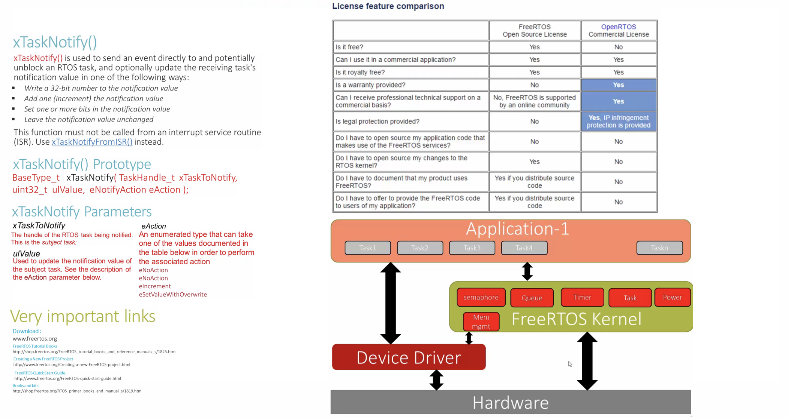
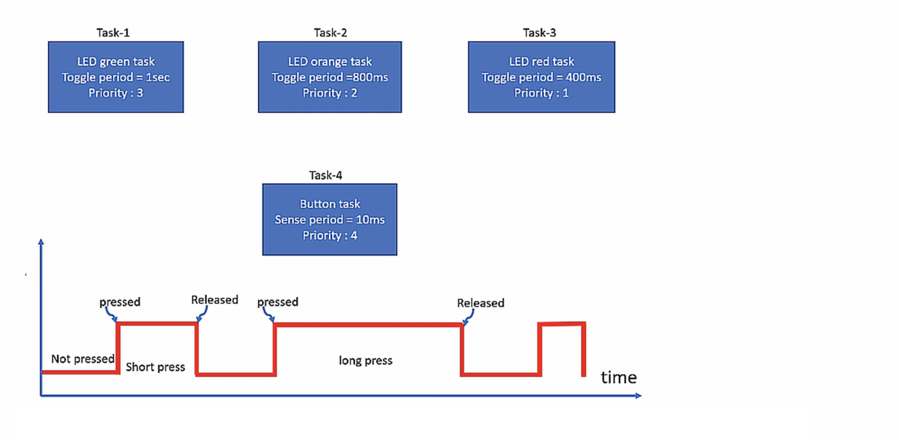

    
		
    
		
    
    
		
    

## Exercise   
     
Task to task notification using direct notification APIs of FreeRTOS    
    
* Create 3 FreeRTOS tasks that toggle 3 LEDs of the STM32F407 DISC    
    
* Create a button task that polls for the button press for every 10ms    
    
* If the button task detects button press, it should send a notification to LED toggling task    
    
* When LED toggling task received the notification, it should delete itself   
    
* Don't forget to follow the [4 steps](https://github.com/noargs/ARM-cortex-m-FreeRTOS-stm32fx/tree/main/02_led_tasks#incorporating-freertos-with-hal-layer) to make FreeRTOS compatible with HAL layer.   
    
* HCLK should raise upto 168MHz to work with `segger_uart.c` in case, we wish to get Continuous (Realtime) Recording	  
		 
		 
         
		 
     
		  	 						 		 
		     
		 
	
    
    
    
    
    
    
    
    
    
  
    
    
    
    
    
    
    
    

     
     

     
     

     
    
    