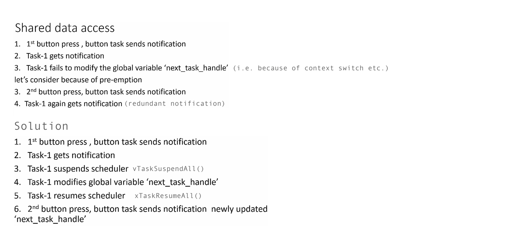

    
		
    
		
    
    
		
    

## Exercise   
     
Task to task notification using direct notification APIs of FreeRTOS    
    
* Create 3 FreeRTOS tasks that toggle 3 LEDs of the STM32F407 DISC    
    
* Create a button task that polls for the button press for every 10ms    
    
* If the button task detects button press, it should send a notification to LED toggling task    
    
* When LED toggling task received the notification, it should delete itself   
    
* Don't forget to follow the [4 steps](https://github.com/noargs/ARM-cortex-m-FreeRTOS-stm32fx/tree/main/02_led_tasks#incorporating-freertos-with-hal-layer) to make FreeRTOS compatible with HAL layer.   
    
* HCLK should raise upto 168MHz to work with `segger_uart.c` in case, we wish to get Continuous (Realtime) Recording	  
		 
		 
   
		 
		 
      
     
		 
> [**vTaskSuspendAll()**](https://freertos.org/a00134.html), 	[**xTaskResumeAll()**](https://freertos.org/a00135.html)	   
    
		
### vTaskSuspendAll()       
      
task.h     
     
`void vTaskSuspendAll( void );`		 			
     
    
Suspends the scheduler. Suspending the scheduler prevents a context switch from occurring but leaves interrupts enabled.  If an interrupt requests a context switch while the scheduler is suspended, then the request is held pending and is performed only when the scheduler is resumed (un-suspended).	   

     
Calls to `xTaskResumeAll()` transition the scheduler out of the Suspended state following a previous call to `vTaskSuspendAll()`.      
      
			
Calls to **vTaskSuspendAll()** can be nested.  The same number of calls must be made to xTaskResumeAll() as have previously been made to vTaskSuspendAll() before the scheduler will leave the Suspended state and re-enter the Active state.	  
     
		 
xTaskResumeAll() must only be called from an executing task and therefore must not be called while the scheduler is in the Initialization state (prior to the scheduler being started).    
     
		 
Other FreeRTOS API functions must not be called while the scheduler is suspended.    
    
		
API functions that have the potential to cause a context switch (for example, vTaskDelayUntil(), xQueueSend(), etc.) must not be called while the
scheduler is suspended.				 		   
    
		
### xTaskResumeAll()      
      
task.h     
     
`BaseType_t xTaskResumeAll( void );`		 			
    
Resumes the scheduler after it was suspended using a call to vTaskSuspendAll().	   

     
xTaskResumeAll() only resumes the scheduler.  It does not unsuspend tasks
that were previously suspended by a call to vTaskSuspend().    
    
**Returns**:    
    
If resuming the scheduler caused a context switch then pdTRUE is returned, otherwise pdFALSE is returned.				     
      
			
	 		 

         
		 
           
		 
     
		  	 						 		 
		     
		 
	
    
    
    
    
    
    
    
    
    
  
    
    
    
    
    
    
    
    

     
     

     
     

     
    
    