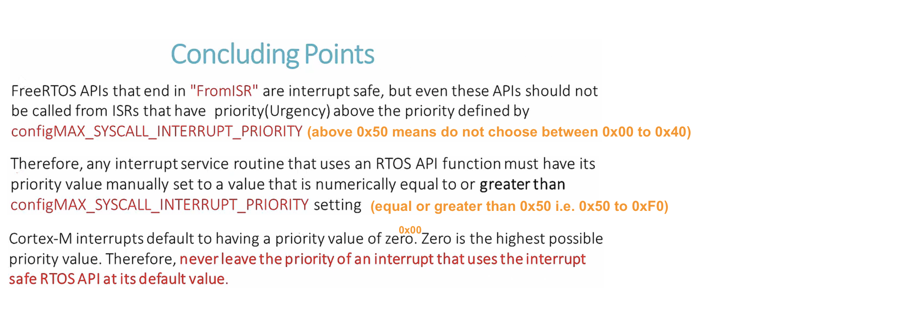

    
		
          
		
          
		
             
      
			

## Exercise   
     
ISR to Task notification using direct notification APIs of FreeRTOS    
    
* Create 3 tasks that toggle 3 different LEDs of the STM32F407 DISC    
    
* When user presses the button, the button interrupt handler must run, and it should send notification to the current LED toggling task    
    
* When LED toggling task receives the notification, it should detele itself     
     
		 
  		 
		   
    
* Don't forget to follow the [4 steps](https://github.com/noargs/ARM-cortex-m-FreeRTOS-stm32fx/tree/main/02_led_tasks#incorporating-freertos-with-hal-layer) to make FreeRTOS compatible with HAL layer.   
    
* HCLK should raise upto 168MHz to work with `segger_uart.c` in case, we wish to get Continuous (Realtime) Recording	  	 
		   
    
* keep the `EXTI0` Interrupt priority lesser than `configMAX_SYSCALL_INTERRUPT_PRIORITY 0x50` i.e. between 0x50 to 0xF0 as shown below.    
     
		 
  		 
     
		 
  		    
     
		 
> [**xTaskNotifyFromISR()**](https://www.freertos.org/xTaskNotifyFromISR.html)     
     
		  
			
			 
### xTaskNotifyFromISR()       
      
task.h     
     
```
BaseType_t xTaskNotifyFromISR( TaskHandle_t xTaskToNotify,
                                uint32_t ulValue,
                                eNotifyAction eAction,
                                BaseType_t *pxHigherPriorityTaskWoken );
```																		 			
   
 	 
     
       		    		 		 
When you inspect the above trace, where button was pressed and ISR22 runs for 13.5us. Meanwhile ISR22 notify the `LED green` Task and `LED green` Task comes into _Task Ready_ state. However ISR22 returns to IDLE task which is lower priority. Whereas it should return to High priority Task `LED green` which was in Task Ready state. The reason being is not using `pxHigherPriorityTaskWoken` (Keeping it NULL) and neither in `portYIELD_FROM_ISR()` (Once the ISR exits, the `portYIELD_FROM_ISR()` macro makes the higher priority task which got unblocked to resume on the CPU). 									
						 
> **pxHigherPriorityTaskWoken** _*pxHigherPriorityTaskWoken_ must be initialised to 0. 
> xTaskNotifyFromISR() will set *pxHigherPriorityTaskWoken to pdTRUE if sending the notification caused a task to unblock, and the unblocked task has a priority higher than the currently running task.
> If xTaskNotifyFromISR() sets this value to pdTRUE then a context switch should be requested before the interrupt is exited.     
> pxHigherPriorityTaskWoken is an optional parameter and can be set to NULL     
     
You get 22 in **ISR 22** when you add offset of 16 (ARM Cortex Mx 16 Exception numbers from 0 to 15) to EXTI line0 IRQ number 6 as shown below. 		
						 			
   
 	 
       
			
			 
### traceISR_ENTER() and traceISR_EXIT()     
     
Helps **SEGGER SystemView** to detect the Entry to an interrupt, otherwise SEGGER SystemView will have no idea that there was an execution of interrupt handler		    
     
		  
			
			 
### portENTER_CRITICAL() and portEXIT_CRITICAL()     
     
Cannot use `vTaskSuspendAll()` here now as `next_task_handle` is shared between Interrupt handler `button_interrupt_handler(void)` as well as FreeRTOS Task handlers.   
    
Whenever you have a critical section (i.e. where global variable is accessed which is shared between multiple tasks and interrupt handler). There you can disable the interrupts of the system, _okay for short duration_ but not recommended to disable interrupts for longer duration, In that case you can switch to mutex or semaphores for synchronisation between different tasks and interrupt handler.   
    
**portENTER_CRITICAL()** also disable the PendSV (prority 0xf0), only interrupts with less than 0x50 (high priority urgeny interrupts from 0x00 to 0x40) are allowed but not greater than 0x50 (low urgency low priority from 0x50 to 0xF0)		 
     
**portENTER_CRITICAL()** uses the `basepri` register of the ARM Cortex Mx processor to disable the interrupt which having priority value upto `configMAX_SYSCALL_INTERRUPT_PRIORITY` (0x50). Therefore disable all the priority values 0x50 to 0xf0 (5to 15). Any interrupt value lower than 0x50 is allowed (i.e. 0x00 to 0x40)	         
		
       
		 
		 
> [!NOTE]
> FreeRTOS APIs can only be used in those interrupt handlers whose priority value is equal to this macro `configMAX_SYSCALL_INTERRUPT_PRIORITY` (0x50) or higher than this 		 	 
      
    

			
	 		 

         
		 
           
		 
     
		  	 						 		 
		     
		 
	
    
    
    
    
    
    
    
    
    
  
    
    
    
    
    
    
    
    

     
     

     
     

     
    
    