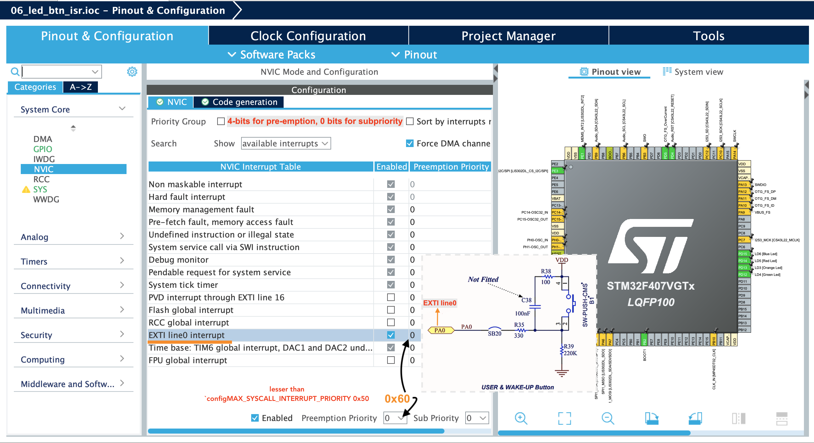
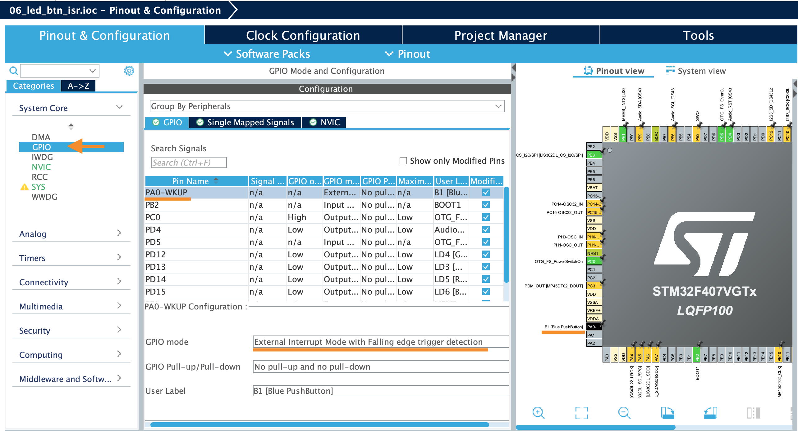

			

## Exercise   
    
Write an application that creates 2 Tasks, Task-1 with priority 2 and Task-2 with priority 3.   
   
Task-1 is a continuous task and should toggle the red LED with 100ms duration between ON and OFF.   
   
Task-2 is also continuous task and should toggle the green LED with 1 second duration between each ON and OFF.    
   
When the user button is pressed, the priority of both the tasks should be exchanged. (Task-1's priority must be reconfigured for Task-2's priority and vice versa)	 	 	 		
    
		
* Don't forget to follow the [4 steps](https://github.com/noargs/ARM-cortex-m-FreeRTOS-stm32fx/tree/main/02_led_tasks#incorporating-freertos-with-hal-layer) to make FreeRTOS compatible with HAL layer.   
    
* HCLK should raise upto 168MHz to work with `segger_uart.c` in case, we wish to get Continuous (Realtime) Recording	  	 
		   
    
* keep the `EXTI0` Interrupt priority lesser than `configMAX_SYSCALL_INTERRUPT_PRIORITY 0x50` i.e. between 0x50 to 0xF0 as shown below.    
     
		 
  		 
     
		 
  		    
     
		 
> [**vTaskPrioritySet()**](https://www.freertos.org/a00129.html),  [**uxTaskPriorityGet()**](https://www.freertos.org/a00128.html), [**xTaskGetHandle()**](https://www.freertos.org/a00021.html#xTaskGetHandle),    [**xTaskGetCurrentTaskHandle()**](https://www.freertos.org/a00021.html#xTaskGetCurrentTaskHandle) 
     
		  
			

			
	 		 

         
		 
           
		 
     
		  	 						 		 
		     
		 
	
    
    
    
    
    
    
    
    
    
  
    
    
    
    
    
    
    
    

     
     

     
     

     
    
    