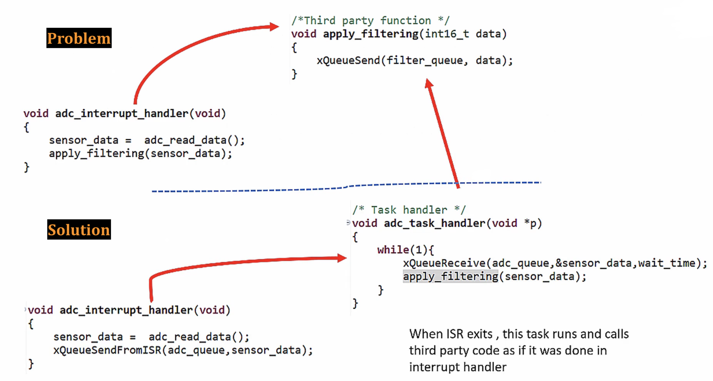

			
## FreeRTOS `FromISR` APIs     
     
**Interrupt safe and Interrupt unsafe APIs**   
    
* There APIs are also called interrupt safe APIs    
    
* These are meant to be used from an interrupt handler			
     
		 
## Why separate `FromISR` APIs  
    		 	 
**1. It makes APIs implementation simpler:**    
    
When called from task context, many RTOS APIs can put the calling task to blocked state, however the same cannot happen when called from interrupt handlers as you cannot put the interrupt handler/context code to blocked state. The blocked state is for tasks, not for interrupt handlers.    
     
Now the API must determine from which context it was being called (i.e. interrupt or task context) and decide accordingly.    
    
This approach increases code overhead, and some architecture doesn't support determining the context. To overcome this problem, FreeRTOS gives separate APIs to be called from interrupt handlers and prohibits using APIs which doesn't end with `FromISR` inside an interrupt handler.    
    
Let's say there are two flavours for QueueSend, `xQueueSend()` and `xQeueSendFromISR`. `xQueueSend()` should use from task context. Alternatively, you should use **FromISR** flavour (i.e. `xQeueSendFromISR`), in case of sending any data from Interrupt handler.     
     
Let's assume that, there are no such a separate APIs. And if you use `xQueueSend()` API from an interrupt context, then this API should find out from which context it was called. Whether from Task context or Interrupt context. And if it is called from Task context, and the queue is full, then this API can put the task context to blocked state. However if it is called from interrupt context and the queue is full, then it cannot put interrupt handler to blocked state. Hence it should take some other decision.    
    
Therefore if there are no a separate APIs for Task as well as Interrupt context, then a single API should implement that logic, differentiating between from which context it was called. Hence increases the code overhead, and some architecture does not support determining the context. To overcome this problem, FreeRTOS gives separate APIs to be called from interrupt handlers and prohibits using APIs which doesn't end with "FromISR" inside an interrupt handler.    
    		 	 
**2. Some API function parameters would be redundant and confusing:**    
    
```
xSemaphoreTake( SemaphoreHandle_t xSemaphore, TickType_t xTicksToWait );   
   
xSemaphoreTakeFromISR( SemaphoreHandle_t xSemaphore, singed BaseType_t *pxHigherPriorityTaskWoken );	 
```							 		
    
Let's say, there is only one API called `xSemaphoreTake()` available for both Task as well as Interrupt context. In that case, parameter `TickType_t xTicksToWait` would become redundant when this API is being called from an interrupt handler. As `xTicksToWait` parameter actually blocks a task for _xTickToWait_ many duration when the semaphore is not available, However that parameter doesn't make sense in the interrupt handler. Hence this parameter would be redundant for call from Interrupt context. Therefore the FreeRTOS gives separate APIs to use inside the interrupt handler.     
     
		 
## Disadvantage of using separate APIs  
    		 	 
1. Application dev must redesign the logic when there is a need to call a third-party function from an interrupt handler when that third-party library function uses FreeRTOS API that doesn't end with `FromISR`   
     
		 
  		 
     
In above case, Let's consider we have an interrupt handler `adc_interrupt_handler()`, where you read the `sensor_data`, or `adc_data` and then you call a third party function `apply_filtering()` which is there in the middleware or any third-party library function. And this third-party library function `apply_filtering()` implements a Non ISR based FreeRTOS API called `xQueueSend()`. In this case you cannot call this `apply_filtering()` function from an interrupt handler. To overcome this problem, you have to redesign your logic. And one possibility could be, the `adc_interrupt_handler()` after it gathers the sensor data it actually sends to some intermediate queue `adc_queue` and it puts the `sensor_data`. And the availability of the data inside the `adc_queue` actually wakes up a task handler named `adc_task_handler()`. Which waits on this queue for the availability of the sensor_data and does the filtering `apply_filtering(sensor_data)`.     
      
			
			
## FreeRTOS Hook Functions			
    
There are many hook functions available:   
   
* Idle Task hook function   
   
* RTOS Tick hook function	   
   
* Dynamic memory allocation failed hook function (Malloc Failed Hook Function)    
    
* Stack overflow hook function    
    
These hook functions (as above) can be implemented in your application code if required.   
The FreeRTOS kernel will call these hook functions whenever corresponding events happen.   
	 					  	 			 	 				  
    		 	 			
		 
### Idle Task hook function    
    
Idle task hook function implements a callback from idle task to your application    
    
You have to enable the idle task hook function feature by setting this config item `configUSE_IDLE_HOOK` to _1_ within `FreeRTOSConfig.h`   
   
Then implement the function `void vApplicationIdleHook(void);` in your application  
   
Whenever idle task is allowed to run, you hook function will get called, where you can do some useful work like sending the MCU to lower power mode to save some power.   
    

 	 					  	 		
    		 	 			
		 
		 
### Tick hook function    
    
`configUSE_TICK_HOOK` should be 1 in `FreeRTOSConfig.h` and your application source file should implement `void vApplicationTickHook(void)`   

 	
    		 	 			
		 
		 
### Malloc Failed hook function    
    
`configUSE_MALLOC_FAILED_HOOK` should be 1 in `FreeRTOSConfig.h` and your application source file should implement `void vApplicationMallocFailedHook(void)`   
    
When you call `xTaskCreate()`, it in turn calls `pvPortMalloc()` in the `task.c` to allocate some memory dynamically in the heap to create TCB and Stack for the task. Hence, the kernel will inform you about the failure in allocating memory by calling the Malloc failure hook function.   
    
		
 	 				
    		 	 			
		 
		 
### Stack over flow hook function    
    
`configCHECK_FOR_STACK_OVERFLOW` should be 1 in `FreeRTOSConfig.h` and your application source file should implement `void vApplicationStackOverflowHook(TaskHandle_t xTask, signed char *pcTaskName)`   
    
As its name indicates whenever your task consumes more than the allowed stack memory (which we pass to `xCreateTask()` function as one of the paramter), that is actually the stack overflow
    
		
## Exercise    
    
Write a program to send Microcontroller to sleep mode when idle task is scheduled to run on the CPU and take the current measurement.   
    
`configUSE_IDLE_HOOK` should be _1_ in your `FreeRTOSConfig.h`					
    
When you try to build the project you will see an error _undefined reference to vApplicationIdleHook_			 
    
Whenever the Idle task is scheduled to run, it does some cleanup activities. Suppose, if you have deleted any task during runtime of your application, then task cleanup happens in the Idle task. if the configuration item in `FreeRTOSConfig.h` has `configUSE_IDLE_HOOK` as _1_ then it `vApplicationIdleHook` must be implemented in your `main.c`.		  
		
 	
    
We will use Sleep mode and run the WFI (Wait For Interrupt) instruction which makes the processor suspend execution (clock is stopped) until one of the following event take place:
   
* An IRQ interrupt   

* An FIQ interrupt   
   
* A Debug Entry request made to the processor	 	 		 				
     
[ARM DEVELOPER](https://developer.arm.com/documentation/ddi0360/e/programmer-s-model/additional-instructions/wait-for-interrupt-wfi)	  
    
```
void vApplicationIdleHook(void)
{
  HAL_PWR_EnterSLEEPMode(PWR_MAINREGULATOR_ON, PWR_SLEEPENTRY_WFI);
}
```			 
    
		 
    
		
Previously we were getting the current consumption of 50mA in this application, However, now current consumption goes down to 18-20mA.		
   
	 
		 
    
		
		 
    
		
     
		  	 			  	 		
    		 	 			 					  	 		
    		 	 			
    	 	 				  
    		 	 			
    
		
		
    


			
	 		 

         
		 
           
		 
     
		  	 						 		 
		     
		 
	
    
    
    
    
    
    
    
    
    
  
    
    
    
    
    
    
    
    

     
     

     
     

     
    
    