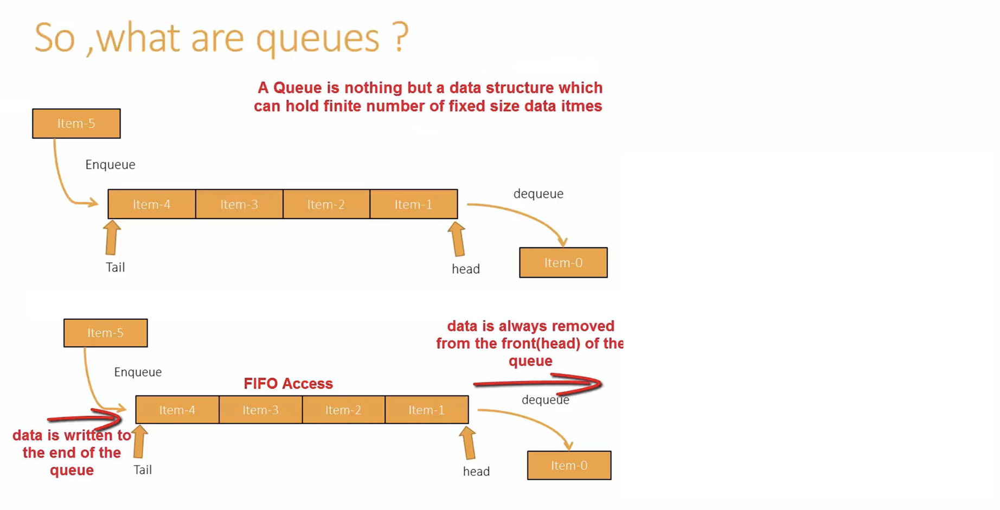
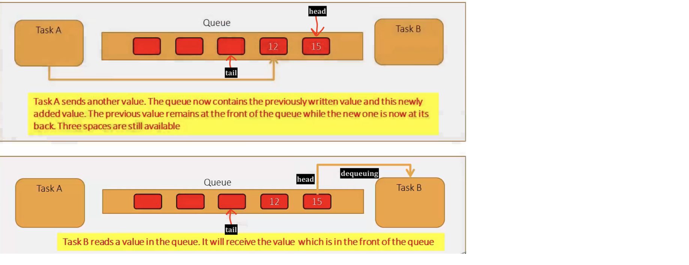
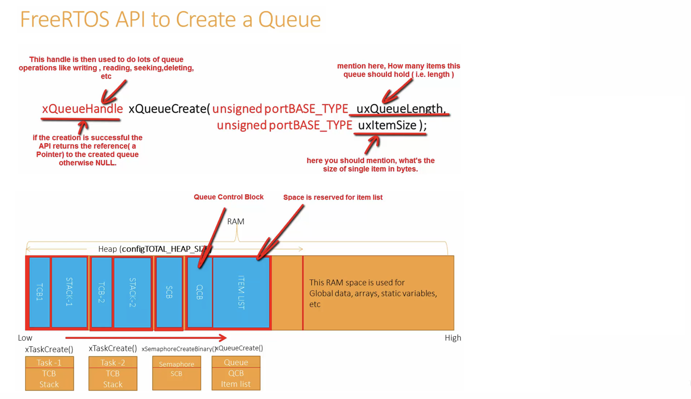

   
	 
 	 	 
    
		
    
		
    
		
    
		
    
		
    
			
    
			
    
		
     
		 
> [Queues](https://www.freertos.org/a00018.html)     
		 
    	 			
## Exercise    
     
Write a FreeRTOS application that takes input (commands) from the user over UART and handles LED and real-time clock (RTC) peripheral of the microcontroller.   
    
This application implements   
   
1. Processing user sent commands over UART  
   
2. FreeRTOS queues handling    
   
3. FreeRTOS software timers	 	 	 				
    
* We use **Tera Term** on windows or **SerialTools** for MacOSX to send commands to over MCU over UART, select checkboxes for **LF** (Line Feed), **Local Echo**, and Baud Rate as **115200**, Parity **none**, Bits **8**, and lastly Stop Bits **1**.		
     
		 
### Application layout      	
    
		
    
		
    
		
		 
### Todo   
     
1. Create a new project   
   
2. Create `main.c`, `task_handler.c`, `led_effect.c`, `rtc.c`    
    
3. In the main function, create   
   - 5 User tasks (same priority for all tasks)
	 - 2 Queues (Inpur data queue and Print queue)     
	    
```
status = xTaskCreate(menu_task, "menu_task", 250, NULL, 2, &handle_menu_task);
```			
    
     
     
     
    
		
		 
    
		
     
		  	 			  	 		
    		 	 			 					  	 		
    		 	 			
    	 	 				  
    		 	 			
    
		
		
    


			
	 		 

         
		 
           
		 
     
		  	 						 		 
		     
		 
	
    
    
    
    
    
    
    
    
    
  
    
    
    
    
    
    
    
    

     
     

     
     

     
    
    