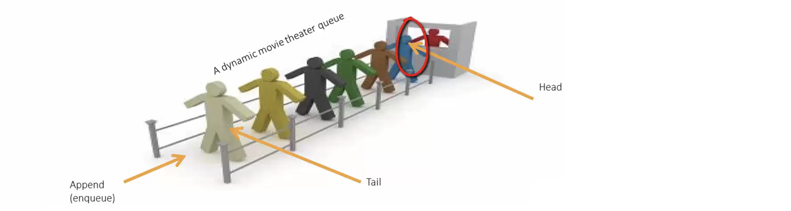
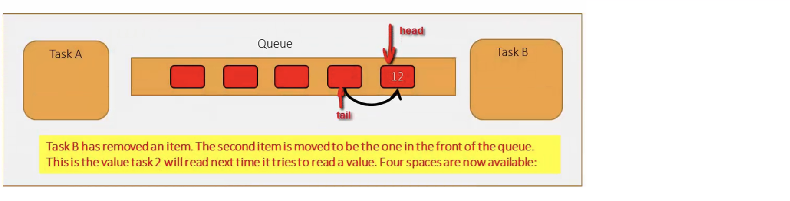
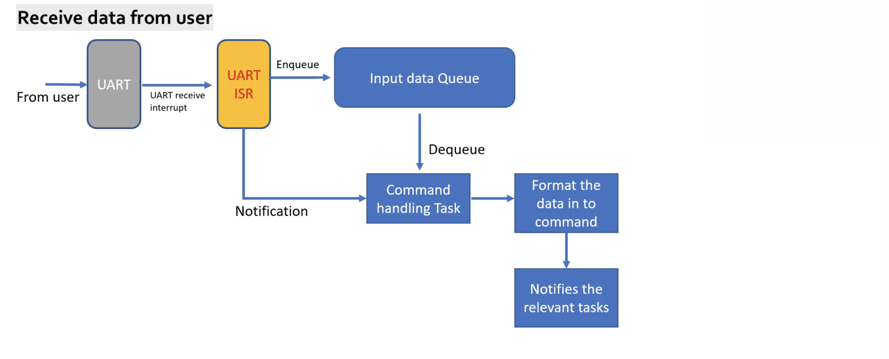

   
	 
 	 	 
    
		
    
		
    
		
    
		
    
		
    
			
    
			
    
		
     
		 
> [Queues](https://www.freertos.org/a00018.html)     
		 
    	 			
## Exercise    
     
Write a FreeRTOS application that takes input (commands) from the user over UART and handles LED and real-time clock (RTC) peripheral of the microcontroller.   
    
This application implements   
   
1. Processing user sent commands over UART  
   
2. FreeRTOS queues handling    
   
3. FreeRTOS software timers	 	 	 				
    
* We use **Tera Term** on windows or **SerialTools** for MacOSX to send commands to over MCU over UART, select checkboxes for **LF** (Line Feed), **Local Echo**, and Baud Rate as **115200**, Parity **none**, Bits **8**, and lastly Stop Bits **1**.     
    
* We will use software timers `configUSE_TIMERS 1`, USART2 to send/receive command, hence we will not use SEGGER SystemView (Continous recording), or you can use Single shot recording, or use different USART peripheral for Continous recording.    
     
* USART2 priority must be greate than 5 (least priority, urgency), we will keep it 6     
     
		 
### Application layout     
    
     	
     
1. Create a new project   
   
2. Create `main.c`, `task_handler.c`, `led_effect.c`, `rtc.c`    
    
3. In the main function, create   
   - 5 User tasks (same priority for all tasks)
   - 2 Queues (Inpur data queue and Print queue)     
	    
```
status = xTaskCreate(menu_task, "menu_task", 250, NULL, 2, &handle_menu_task);
```		     	
    
		
    
		
    
    
### Receiving data from user       
    
		   
     
* Enable UART data reception (byte by byte) in IT mode `HAL_UART_Receive_IT()`   
* Implement UART receive complete callback `HAL_UART_RxCpltCallback(UART_HandleTypeDef *huart)` in `main.c` as shown below.   
  * Store the data byte into input data queue     
  * When `\n` is detected, notify the command handling task `cmd_task_handler`    
      
      
```
void HAL_UART_RxCpltCallback(UART_HandleTypeDef* huart)
{
	if ( /* check: id queue full ? */) 
	{
		/* Queue is not full */
		/* Enqueue data byte */
	} else {
		/* Queue is full */
		if ( /* check, is user_data '\n'? */ )
		{
			/* user_data = '\n' */
			/* make that last data byte of queue is '\n' */
		}
	}
	
	/* send notification to command handling task if user_data = '\n' */
	
	/* Enable UART data byte reception again in IT mode */
}	  
   
   
## Command handling task   
    
1. implement command handling task   
     
2. process user entered data and convert it to a command    
     
3. based on current state of the application, notify the relevant task.               
     
```
void cmd_task_handler(void* parameter)
{
  while (1)
  {
    /* first time it runs when launch the scheduler, hence it should wait, so implement notify wait */
    /* process the user data (command) store in the input data queue */
    /* notify the command to relevant task */
  }
}


/* command format */
typedef struct
{
  uint8_t payload[10]; /* stores data bytes of the command */
  uint8_t len;         /* command length */
}command_t;
```		 
     
     
## Application states
   
We need to introduce a state variable `state_t` to keep track of which menu the user is in.   
   
```
typedef enum
{
  sMainMenu =0,
  sLedEffect,
  sRtcMenu,
  sRtcTimeConfig,
  sRtcDateConfig,
  sRtcReport,
}state_t;      
```       
     
     
     
  	

    
		
		 
    
		
     
		  	 			  	 		
    		 	 			 					  	 		
    		 	 			
    	 	 				  
    		 	 			
    
		
		
    


			
	 		 

         
		 
           
		 
     
		  	 						 		 
		     
		 
	
    
    
    
    
    
    
    
    
    
  
    
    
    
    
    
    
    
    

     
     

     
     

     
    
    