## ARM Cortex M FreeRTOS on STM32Fx

           
[Download](https://github.com/FreeRTOS/FreeRTOS/releases/download/202012.00/FreeRTOSv202012.00.zip)  FreeRTOSv202012.00 on GitHub    
    
		
		
## Development Board used  
     
		 
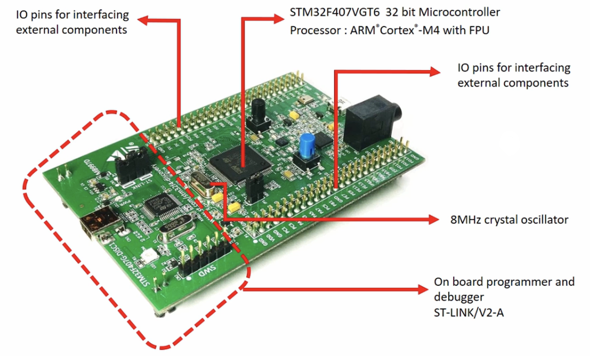  		 		
     
		 
## What is Real Time Application (RTA)?     
     
		 		 
**What are the truths and myths related to the word of real time computing.**    
     
* The **myth** is the Real time computing is equivalent to fast computing, but the **truth** is the Real time computing is equivalent to predictable computing.     
     
		 
* The word real time signifies that, the application or the operating system deals with guarantees (_not with promises_), not with just the raw part of the system.   
     
		 
* Whenever we say something is real time, then the timeliness is more important. It promises to meet its deadline for a given timeline instead of just talking about raw speed.

> The application developers who think they need a real time system for better performance of their application can actually get the performance they require by simply upgrading their hardware with faster processors, RAM, high speed buses, etc.    
     
* A Real time system is one in which the correctness of the computations not only depends upon the logical correctness of the computation, but also upon the time at which the result is produced. If the time constraints are not met, system failure is said to have occurred.    
     
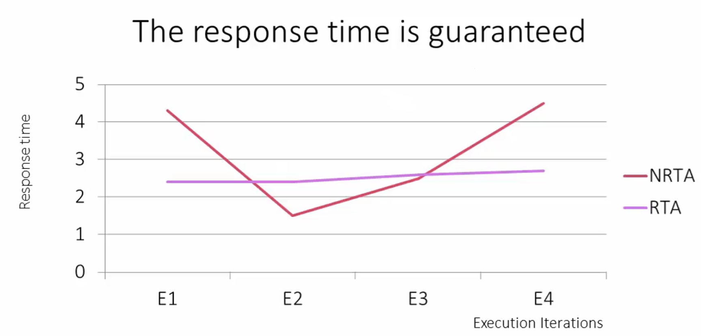 		
    
		
For example, Above graph has red line indicates that it is a non real time application (_NRTA_) and pink line indicates a real time application (RTA). This graph shows execution iterations versus response time.    
      
Here you can see, during multiple iterations the execution time or the response time of a real time application (_RTA_) is almost constant. It is roughly taking around 2.5 seconds for every iteration.  
    
However a non real time application (_NRTA_), response time is varies. For the first iteration it took 4 seconds and then 1.5, 2.5 and finally 4 seconds. It doesn't meet the timeliness behaviour.

You cannot trust this application, as it's response time is keep on varying between different iterations. On the other hand, a real time application promises a fairly constant response time, no matter in which constraint you execute that application.   
    
		
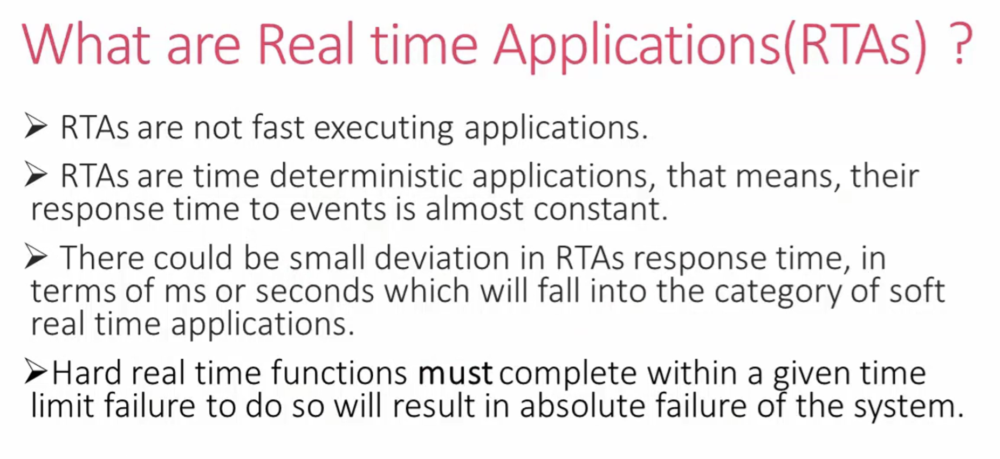    
     
	
For example, the airbag triggering mechanism in a car is an example of **hard real time** function. The air bag must be deployed within a given time limit of an impact. A response falling outside of this time limit can result in the driver sustaining injuries that could otherwise have been avoided.   
    
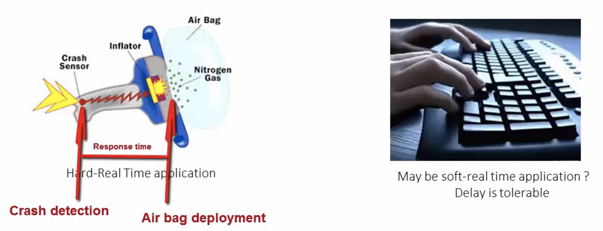   
     
		 
**Soft real time** requirements are those that state time deadline, but breaching the deadline would not render the system useless. There could be a small deviation in terms of milliseconds or seconds, in terms of response time of a soft real time requirements. So, they are not strict as hard real time systems.    
     
		 
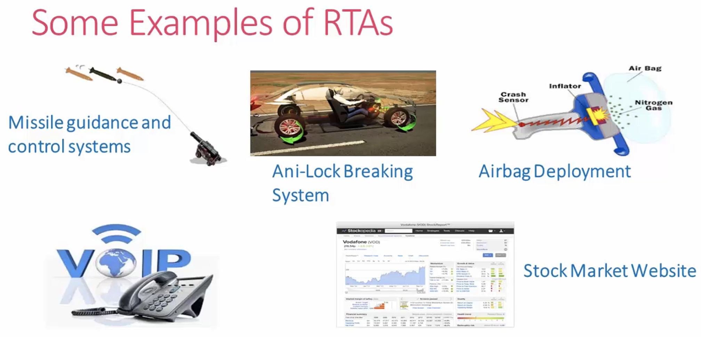    
     
		 
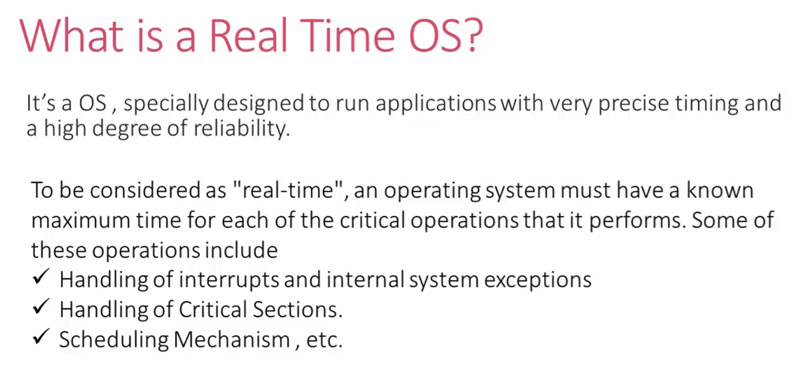   
     
		 
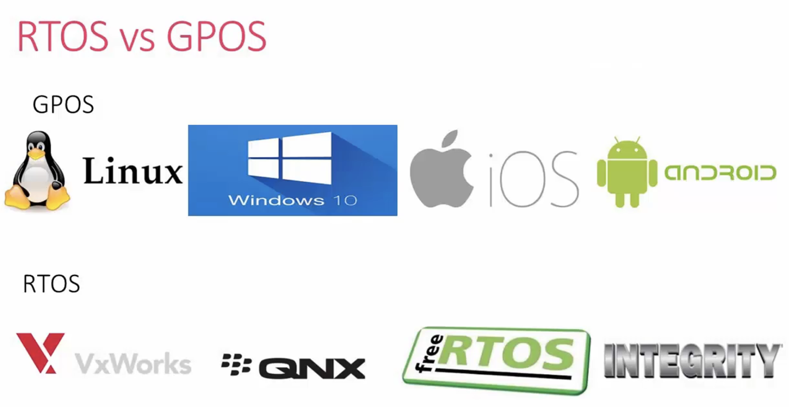   
     
		 
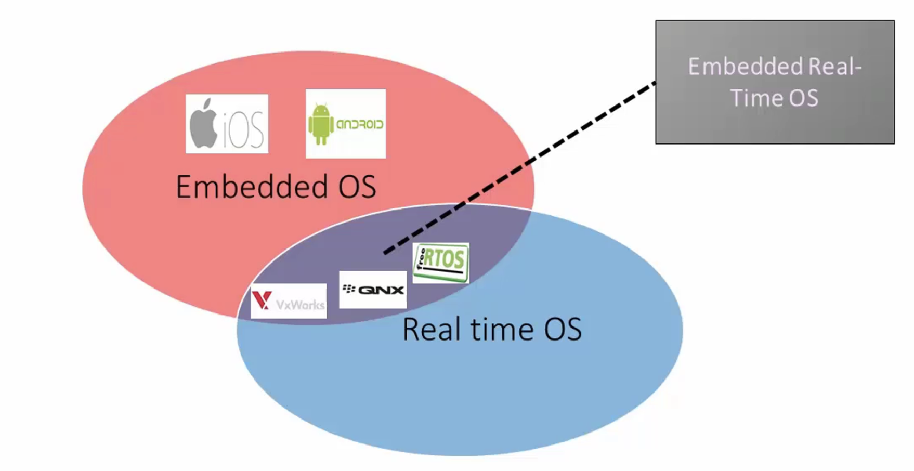   	 		
     
		 
## Task Scheduling  
     
		 
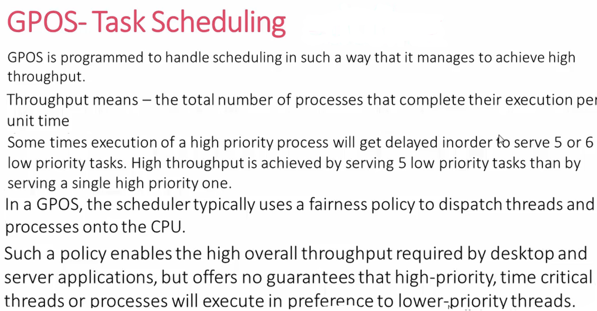     
		 
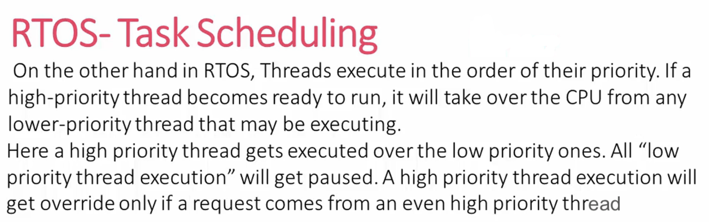   
		 
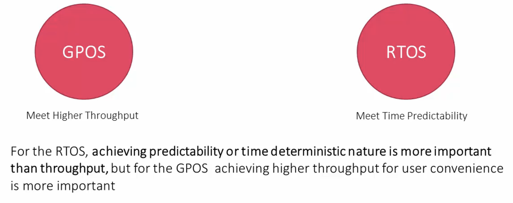    
		 
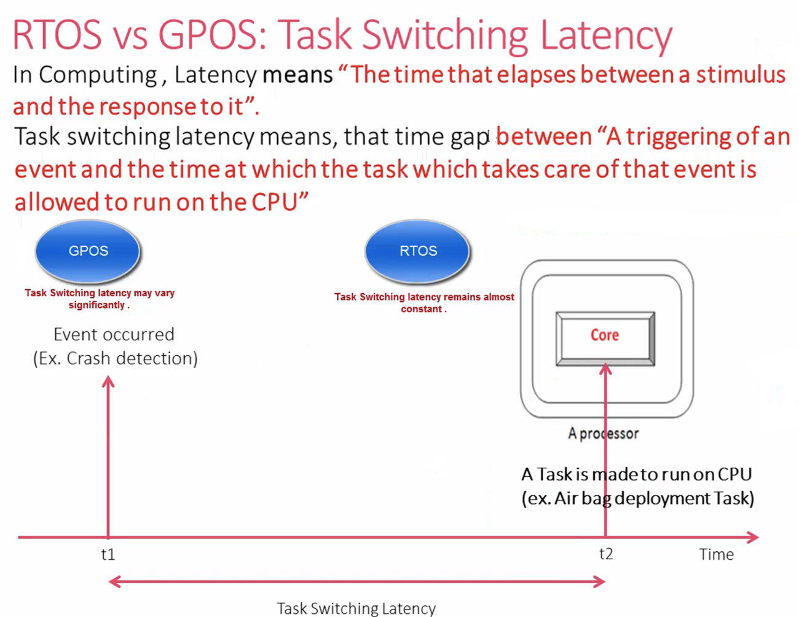  
		 
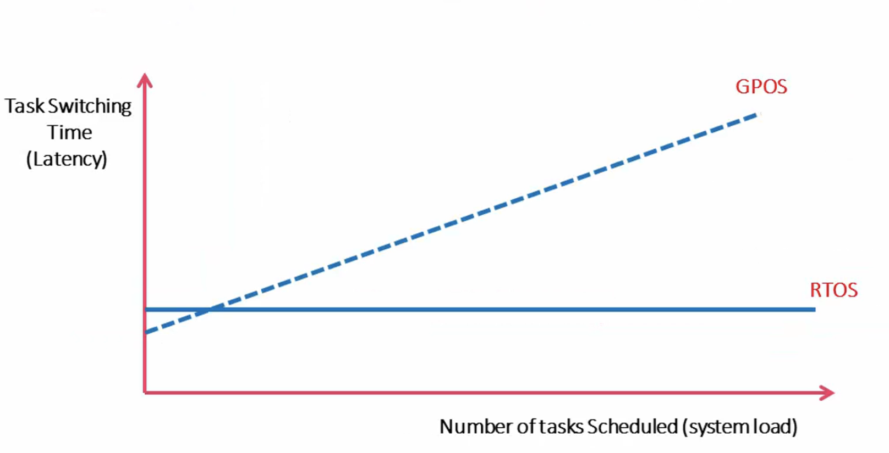  
		 
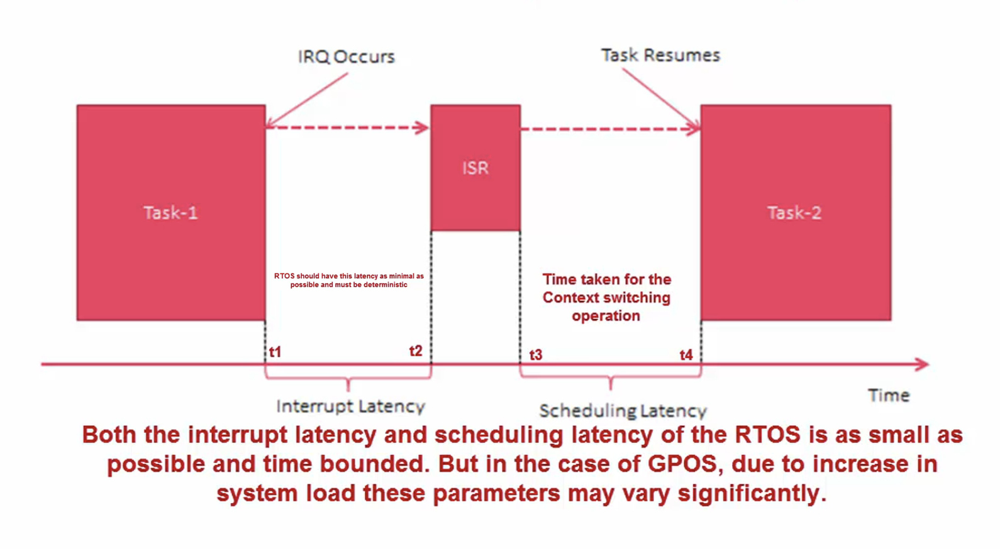      	 		
     
		 
## RTOS vs GPOS: Priority inversion?    
     
Suppose we have a lower priority task, a medium priority, and a higher priority task. And we have a shared resource and let’s say the lower priority task has acquired the key to access this shared resource. But it is not allowed to run on the CPU because lots of medium priority tasks are running on the CPU, which won’t allow lower priority tasks to take the CPU.     
     
		 
Now when the higher priority task enters, it cannot access this shared area because the key is taken by the lower priority task, but the lower priority task is not allowed to run. It can only give up the key once it is allowed to run. So, until the lower priority task runs, the key will be locked for this shared resource, and the higher priority task cannot access it. Therefore, the higher priority task has to wait until the lower priority task releases the key, causing the **inversion in priority**.    
    
		
In GPOS, this is not at all a major issue. But in RTOS, it will definitely lead to issues because you are blocking the higher priority task to execute.    
     
		 
Most of the real-time kernels use some techniques to solve this issue. An RTOS can create paths on the fly, which allows the higher priority task to bypass a lower priority task. That we call as rescheduling, or there could be other techniques like temporarily making lower priority task as a higher priority task and medium priority task as a lower priority task, and giving a chance for the lowest priority task to run and release the key. An RTOS uses all these techniques to minimise the priority inversion problem.				
		 
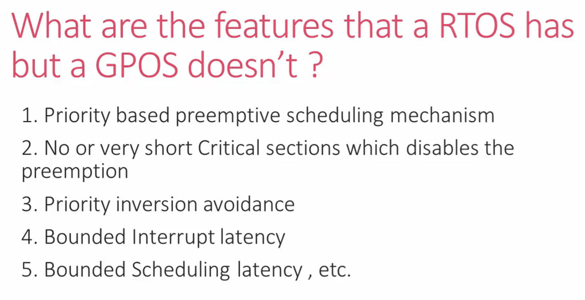    
     
		 
		 
## Multitasking?     
    
In multitask able computing, an application may consist of multiple tasks. Each task is supposed to carry out one unique functionality. Let’s say there is an application called a temperature monitor system, which has got 3 unique tasks as follows:    
   
* **Task1**: Sensor data reading.    
   
*	**Task2**: Updates the display.    
    
* **Task3**: It processes the user inputs like a button press, etc.
    
This application implements multiple tasks.		 	 		
     
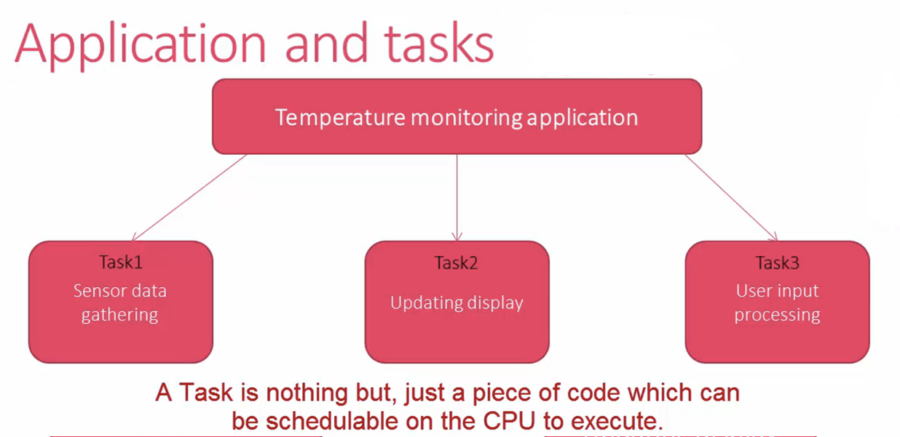   		 
     
> A task means a piece of code, which can run on CPU and execute.    	
     
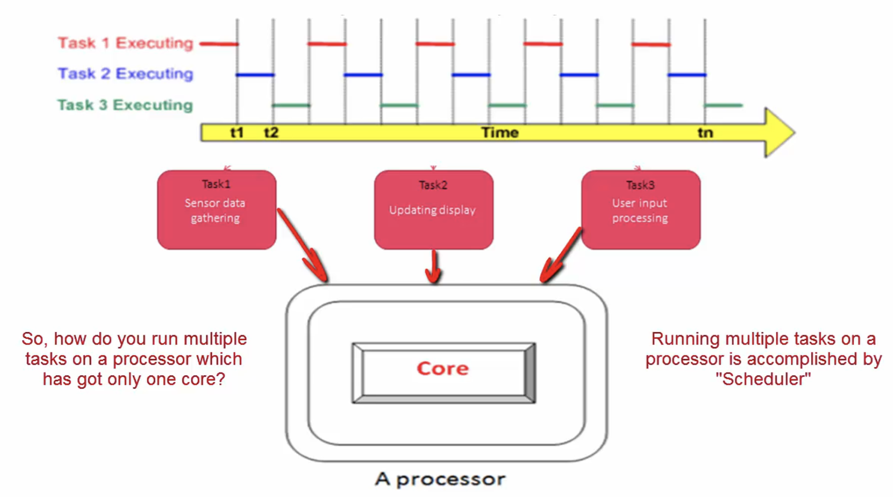  
     
		 
Let’s say we have a processor with four cores as shown below. In this case, we don’t need a scheduler to run this application since it has got four cores, and each core can execute one task. So, all these three tasks can execute simultaneously. 		  		
     
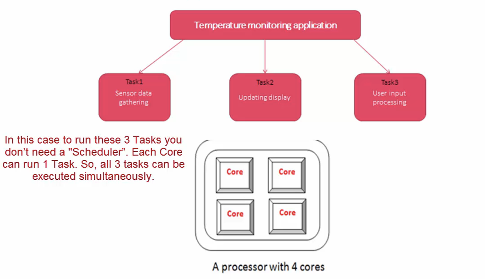  
    
		
However in the embedded world, we don’t usually use a processor with multiple cores. Instead we have one core and multiple tasks. And To run all these tasks, you will need a scheduler, and it will decide which task should take the CPU next		
     
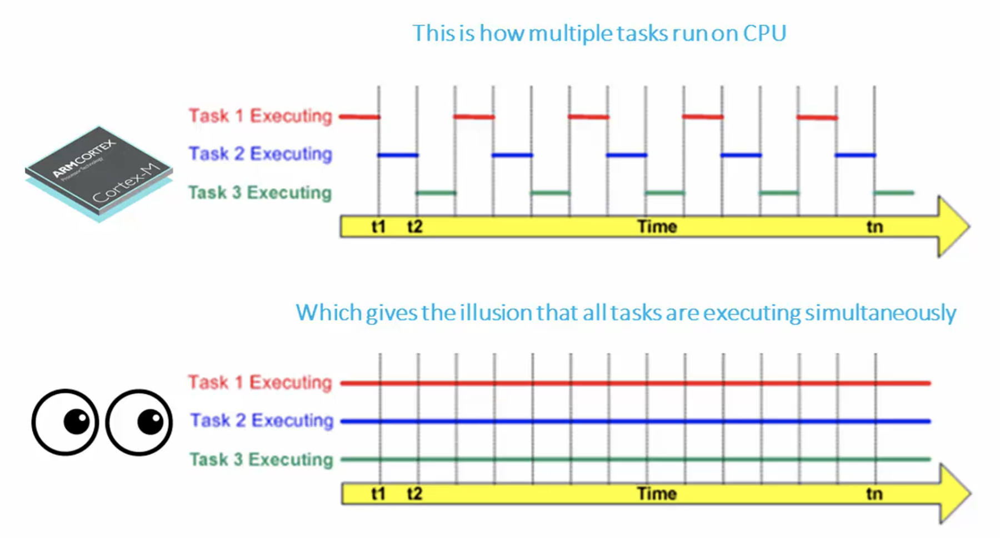  
    
		
    
		
     
		  
     
    
		
				 
      

     
		 
		 
     
		 
		 
      
			
			
     
		 
		 		 		 

     
